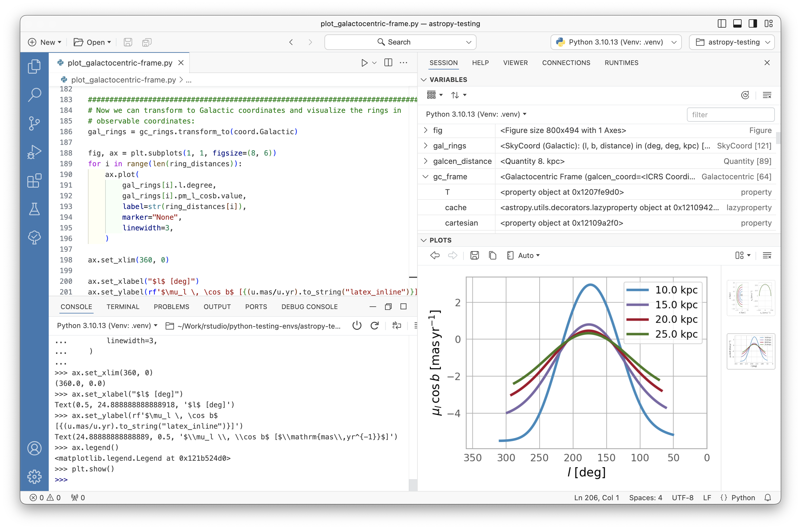
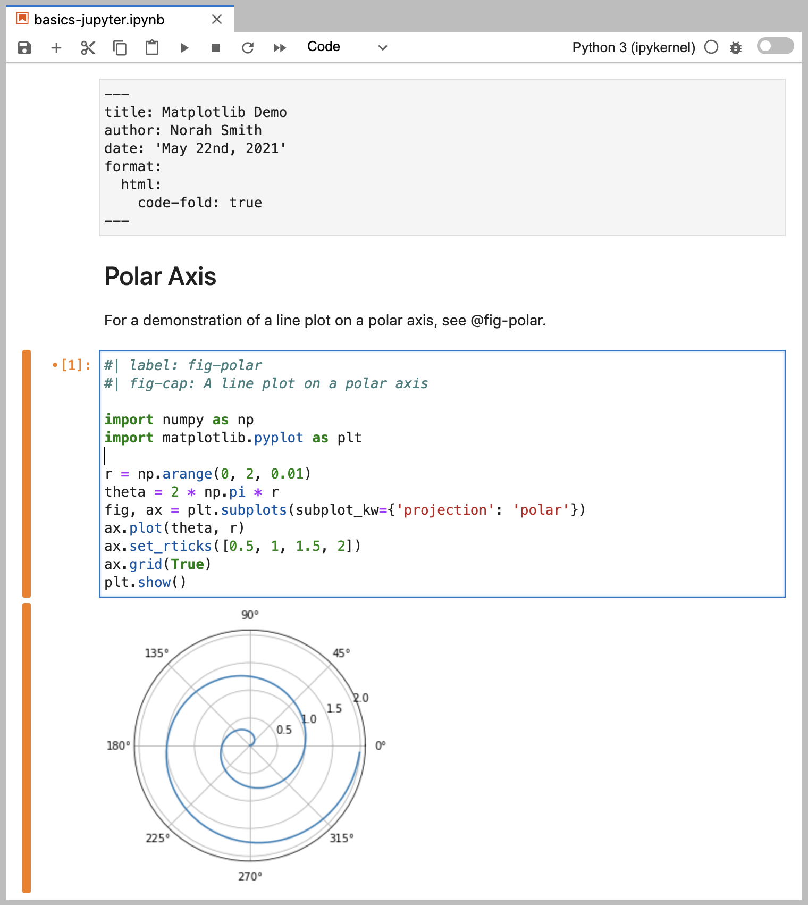
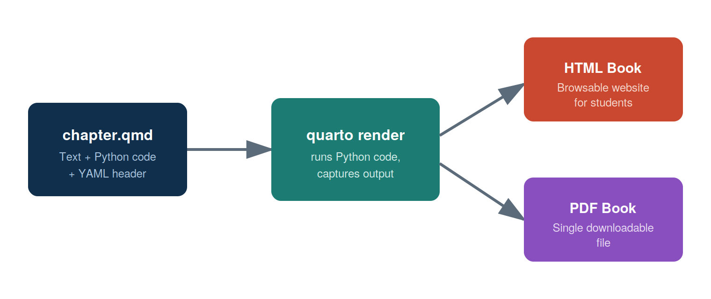
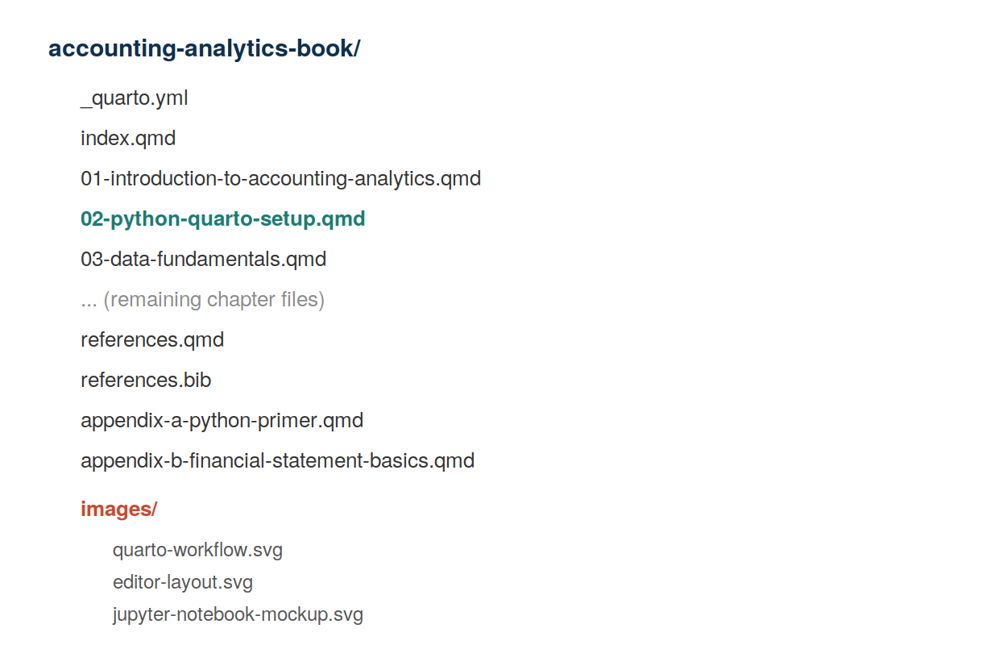

# Python and Quarto Environment Setup

::: {.callout-note}
## Learning Objectives
By the end of this chapter, you should be able to:

- Install Python, Quarto, and a code editor on your own computer
- Explain the difference between a Jupyter notebook (`.ipynb`), a plain Python script (`.py`), and a Quarto document (`.qmd`)
- Create, edit, and render a Quarto document containing Python code
- Render a Quarto book to both HTML and PDF
- Install and import the Python packages used throughout this book (pandas, numpy, matplotlib)
:::

## Why This Chapter Matters

Every chapter after this one assumes you can do three things: write Python code, run it, and see the results in a nicely formatted document. This chapter gets that pipeline working on your own laptop, once, so that the rest of the course is about *accounting analytics* rather than *fighting with software installation*.

If you get stuck at any point in this chapter, don't worry — environment setup is almost always the hardest part of a data analytics course, and it only gets easier from here.

## The Three Tools You Need

| Tool | What it does | Analogy |
|---|---|---|
| **Python** | The programming language that does the actual data work | The engine |
| **Quarto** | Combines your writing, Python code, and output into one document (HTML, PDF, Word) | The publishing system |
| **A Code Editor** (Also called Integrated Development Environment(IDE))  | Where you write and run your code (this book uses Positron, but VS Code works identically) | The workshop |

You need all three installed before you can complete the exercises in this book.

## Step 1: Install Python

You can install the python from <https://www.python.org/downloads/>. We recommend you use this link to install a specific version of python. Your professor might recommend a specific version that you should use. If you use macOS, please click `macOS` to install python suitable for mac.

In addition, you can also install Python via the **Anaconda** or **Miniconda** distribution, because it comes bundled with the data packages we'll use (pandas, numpy, matplotlib) and makes managing versions easier than a bare Python install.

1. Download Miniconda from [https://docs.conda.io/en/latest/miniconda.html](https://docs.conda.io/en/latest/miniconda.html) (choose the installer for your operating system).
2. Run the installer with default settings.
3. Confirm the install worked by opening a terminal and typing:

```bash
python --version
```

You should see something like `Python 3.11.x` (the exact version doesn't need to match this).

::: {.callout-tip}
## Connect to Practice
If your future employer uses a specific data platform (e.g., a cloud data warehouse, or a company-managed Python environment), the *concepts* you learn here transfer directly — only the installation step changes.
:::

## Step 2: Install Quarto

1. Go to [https://quarto.org/docs/get-started/](https://quarto.org/docs/get-started/) and download the installer for your operating system.
2. Run the installer with default settings.
3. Confirm the install worked:

```bash
quarto --version
```

Since we'll render to PDF as well as HTML, also install a LaTeX distribution — Quarto includes a lightweight one you can install with a single command:

```bash
quarto install tinytex
```

This only needs to be done once per computer.

## Step 3: Install a Code Editor

This book's examples use **Positron**, which can be downloaded from <https://positron.posit.co/download.html>. Positron is a code editor built specifically for data science that will feel very familiar if you've used VS Code before — the two share the same underlying editing engine, so keyboard shortcuts, extensions, and layout all work the same way. (If your instructor prefers plain VS Code, everything in this chapter applies identically.)

@fig-editor-layout shows the general layout you'll be working in for the rest of this book: a file explorer on the left, an editor pane in the middle where you write your `.qmd` files, a terminal at the bottom where you run commands like `quarto render`, and a Source Control panel for Git (covered separately if your instructor uses version control in this course).

{#fig-editor-layout width=90%}

Once installed, open your project folder in Positron/VS Code using **File → Open Folder**, and select the folder containing your `_quarto.yml` file.

## Three Ways to Write Python: Script, Notebook, or Quarto Document

As you start doing accounting analytics work, you'll encounter three common file types for writing Python. It's worth understanding the difference early, since this book uses all three at different points.

### 1. A Plain Python Script (`.py`)

A `.py` file contains only code — no narrative text, no formatted output. You run the whole file at once (or line by line) and see output printed to a terminal or console. This is the format used for production code, reusable functions, or automated jobs that don't need explanation baked in.

```python
# analysis.py
import pandas as pd

df = pd.read_csv("data/trial_balance.csv")
print(df.head())
```

### 2. A Jupyter Notebook (`.ipynb`)

A Jupyter notebook mixes code and narrative text in a sequence of **cells**, and shows output (tables, charts) directly underneath the code that produced it. This makes notebooks excellent for exploratory analysis — trying things out, looking at results immediately, and iterating.

@fig-jupyter-mockup shows a simplified notebook: a markdown cell explaining what's about to happen, a code cell that loads data, and the output (a data table) displayed directly below it.

{#fig-jupyter-mockup width=85%}

You can open and run `.ipynb` files directly in Positron/VS Code, the same as in classic Jupyter.

### 3. A Quarto Document (`.qmd`)

A Quarto document looks a lot like a notebook conceptually — narrative text plus embedded, runnable code — but it's a **plain text file** (easier to track with Git) that can render to multiple polished output formats: HTML, PDF, Word, and more. This is the format used for every chapter in this book.

A Quarto document has three parts:

1. A **YAML header** at the top (between `---` lines) with metadata like the title
2. **Narrative text** written in Markdown
3. **Code chunks**, marked with three backticks and curly braces

```` markdown
---
title: "Example Chapter"
---

## Analyzing the Trial Balance

Here we load the trial balance and preview the first few rows.

```{python}
import pandas as pd

df = pd.read_csv("data/trial_balance.csv")
df.head()
```

The output above shows account balances before adjusting entries.
```` 

::: {.callout-important}
## Which format does this book use?
Every chapter in *this* book is written as a `.qmd` file, since we want a single, polished, professional document (in both HTML and PDF) at the end of the semester — not a folder of separate notebooks. However, your instructor may ask you to *practice and experiment* in a Jupyter notebook before copying finished code into your chapter or assignment `.qmd` file. Think of the notebook as your scratch paper and the `.qmd` file as your final submission.
:::

## Your First Quarto Document

Let's create a small Quarto document from scratch to make sure everything works end to end.

**1. Create a new file** called `test.qmd` in your project folder with the following content:

```` markdown
---
title: "My First Quarto Document"
format: html
---

## Testing My Setup

```{python}
import pandas as pd

data = {"account": ["Cash", "Accounts Receivable", "Inventory"],
        "balance": [12500, 8200, 15300]}

df = pd.DataFrame(data)
df
```

If you can see a table above with three accounts, your Python and Quarto setup is working correctly.
```` 

**2. Render it.** In the terminal, run:

```bash
quarto render test.qmd
```

**3. Open the result.** This creates `test.html` in the same folder — open it in your web browser and confirm you can see the table.

If this worked, your environment is fully set up. If you got an error, check the Troubleshooting section at the end of this chapter before moving on.

## Rendering This Book's Project (HTML and PDF)

Your course textbook project is set up as a **Quarto book** (multiple chapters combined into one publication), which is slightly different from rendering a single file. From the terminal, inside your project folder (the one containing `_quarto.yml`):

```bash
quarto render
```

This single command renders *every* chapter listed in `_quarto.yml` and produces both formats we configured:

- `_book/index.html` — an HTML website you can open in a browser or host online
- a single PDF file inside `_book/` — a downloadable, printable version of the entire book

@fig-quarto-workflow summarizes this process: your `.qmd` source files go in, `quarto render` executes the Python code and assembles the document, and both an HTML and a PDF version come out the other side from the *same source file* — you never have to write your content twice.

{#fig-quarto-workflow width=90%}

To preview your book live while editing (auto-refreshing as you save changes), use:

```bash
quarto preview
```

## Installing the Python Packages You'll Need

This book relies on a small set of Python packages. If you installed Python via Anaconda/Miniconda, most of these are likely already available. To install (or confirm) them, run:

```bash
pip install pandas numpy matplotlib jupyter
```

Confirm they're installed correctly by running this in a `.qmd` code chunk or a notebook cell:

```{{python}}
import pandas as pd
import numpy as np
import matplotlib

print(pd.__version__)
print(np.__version__)
print(matplotlib.__version__)
```

If this runs without errors and prints three version numbers, you're ready for Chapter 3.

## Organizing Your Project Folder

As your book (or your homework project) grows, keeping files organized will save you real time. @fig-folder-structure shows the recommended structure, which matches how this book's own project folder is organized: one `.qmd` file per chapter, a shared `images/` folder for figures, and the configuration file (`_quarto.yml`) at the top level.

{#fig-folder-structure width=75%}

A couple of habits worth building now:

- Keep all figures in a single `images/` folder rather than scattering them across the project — it makes the project easier to navigate and easier to back up.
- Give files and images descriptive, lowercase, hyphenated names (e.g., `revenue-by-quarter.png`, not `Figure1_FINAL_v2.png`) — this avoids broken links when you rename things later and matches conventions used in real data projects.

## Troubleshooting Common Setup Issues

::: {.callout-warning}
## "quarto: command not found"
This usually means Quarto wasn't added to your system's PATH during installation. Try closing and reopening your terminal (and your code editor) after installing Quarto — this alone fixes the issue most of the time. If it persists, reinstall Quarto and confirm you allowed it to modify your PATH during setup.
:::

::: {.callout-warning}
## "ModuleNotFoundError: No module named 'pandas'"
Python can't find the package because it isn't installed in the environment your editor is using. Run `pip install pandas` in the same terminal your editor uses, and confirm you're using the Python interpreter you expect (in Positron/VS Code, check the interpreter shown in the bottom status bar).
:::

::: {.callout-warning}
## PDF rendering fails but HTML works fine
This almost always means the LaTeX installation is missing or incomplete. Run `quarto install tinytex` and try again. If it still fails, re-render with `quarto render --to pdf --log render.log` and check the log file for the specific missing package.
:::

## Chapter Summary

- Python, Quarto, and a code editor (Positron or VS Code) are the three tools needed for this course, and each is installed once at the start of the semester.
- A `.py` script, a `.ipynb` notebook, and a `.qmd` Quarto document all run Python code, but serve different purposes: scripts for production code, notebooks for exploration, and Quarto documents for polished, reproducible reports — which is why this book is written entirely in `.qmd` files.
- `quarto render` turns your `.qmd` source into both HTML and PDF from a single source of truth.
- Keeping a consistent project folder structure (chapters at the top level, a shared `images/` folder) will save you time throughout the semester.

## Exercises

1. Complete the "Your First Quarto Document" walkthrough in this chapter. Take a screenshot of your rendered HTML output showing the table, and submit it as instructed by your course syllabus.
2. In your own words (2–3 sentences), explain when you would choose to use a Jupyter notebook versus a Quarto document for a piece of analytical work.
3. Intentionally introduce one small error into your `test.qmd` file (e.g., misspell `pandas` as `panadas`), render it, and copy the error message you get. Then fix it and re-render successfully. This exercise is designed to make error messages feel less intimidating early in the course.
