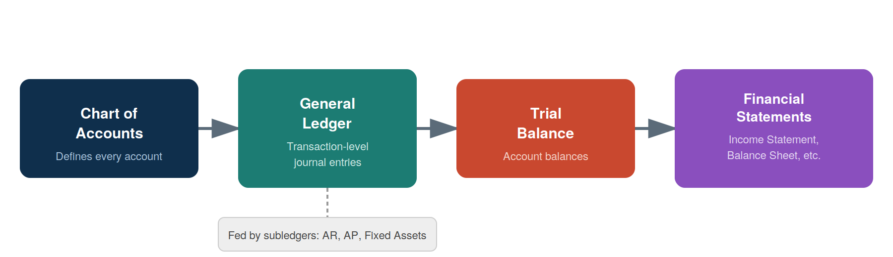

# Data Fundamentals for Accountants

::: {.callout-note}
## Learning Objectives
By the end of this chapter, you should be able to:

- Explain tidy data principles and identify whether a table is tidy or messy
- Identify the four levels of measurement and match them to common accounting variables
- Recognize the main data types encountered in accounting data (numeric, categorical, date/time, text, boolean)
- Describe the structure and relationship between the chart of accounts, general ledger, trial balance, and subledgers
- Explain the difference between transaction-level and summarized data, and why analytics often needs the former
- Identify common data quality issues in real-world accounting datasets
:::

## Why Data Structure Matters Before You Start Coding

It's tempting to jump straight into pandas and start writing code — and we will, starting next chapter. But most real-world accounting analytics problems are **data problems**, not coding problems. A well-written line of Python code applied to poorly structured or misunderstood data will still give you a wrong (or misleading) answer.

This chapter builds the conceptual foundation you need before touching code: what "well-structured" data looks like, what kinds of data you'll encounter, how core accounting datasets are organized, and what tends to go wrong with real data. Think of this as learning to read a map before you start driving.

## Tidy Data Principles

**Tidy data** is a simple, widely-used standard for organizing tabular data so that it's easy to analyze. A dataset is tidy when:

1. **Each variable forms a column.**
2. **Each observation forms a row.**
3. **Each type of observational unit forms a table.**

This sounds abstract, so let's look at an example. Suppose you have quarterly revenue by product line.

**Messy (wide) version** — each quarter is its own column:

| product_line | Q1 | Q2 | Q3 | Q4 |
|---|---|---|---|---|
| Consulting | 42,000 | 45,500 | 47,200 | 50,100 |
| Software | 61,000 | 58,000 | 63,500 | 70,200 |

This looks fine to read as a human, and it's a completely normal way to present numbers in a report. But it's **not tidy**: "quarter" is a variable that's been spread across four columns instead of living in a single column.

**Tidy (long) version** — the same data, restructured:

| product_line | quarter | revenue |
|---|---|---|
| Consulting | Q1 | 42,000 |
| Consulting | Q2 | 45,500 |
| Consulting | Q3 | 47,200 |
| Consulting | Q4 | 50,100 |
| Software | Q1 | 61,000 |
| Software | Q2 | 58,000 |
| Software | Q3 | 63,500 |
| Software | Q4 | 70,200 |

::: {.callout-tip}
## Connect to Practice
Tidy data isn't just an academic preference. In Chapter 4, you'll see that pandas operations — filtering, grouping, plotting — are dramatically easier when your data is tidy. A wide table like the "messy" example above requires extra reshaping steps before you can, say, plot revenue trends across all product lines on one chart.
:::

You don't need to memorize a rulebook here — the practical test is: *if I wanted to filter, group, or plot by any single variable, is that variable sitting in one clearly labeled column?* If yes, you're likely looking at tidy data.

## Levels of Measurement

Before you calculate anything — an average, a sum, a comparison — it's worth asking: *what kind of variable is this, and what operations actually make sense on it?* This is the idea behind **levels of measurement**, a classification used throughout statistics.

There are four levels, each allowing more mathematical operations than the last:

| Level | Description | Accounting Example | Meaningful Operations |
|---|---|---|---|
| **Nominal** | Categories with no inherent order | Account type (Asset, Liability, Equity), Department, Vendor name | Count, mode, group by |
| **Ordinal** | Ordered categories, but differences between levels aren't meaningful | Credit risk rating (Low/Medium/High), Audit opinion severity | Count, mode, median, ranking |
| **Interval** | Meaningful differences, but no true zero | Fiscal year, Credit score (in some scales) | Addition/subtraction, mean, but not meaningful ratios |
| **Ratio** | True zero point; all arithmetic is meaningful | Account balance, Transaction amount, Units sold | Mean, sum, ratios, all standard arithmetic |

::: {.callout-important}
## Why This Matters in Practice
It's easy to make a technically-valid-looking calculation that is conceptually meaningless. For example: averaging a customer's credit risk rating of "Low, Medium, High" by assigning them 1, 2, 3 and computing a mean of 1.8 *looks* like a real number, but "1.8" doesn't correspond to any real risk category — ordinal data doesn't support that kind of averaging. Similarly, summing account numbers from your chart of accounts (nominal data, even though it's stored as a number) produces a number with no accounting meaning at all.

We'll return to this idea in Chapter 5, where choosing the right summary statistic depends directly on a variable's level of measurement.
:::

## Data Types You'll Encounter

Related to levels of measurement, but more about how data is *stored and represented* in a dataset, are data types. In accounting data, you'll regularly see:

- **Numeric — continuous**: dollar amounts (account balances, transaction amounts) — ratio-level, all arithmetic makes sense
- **Numeric — discrete**: counts (units sold, number of invoices) — ratio-level, but only whole numbers make sense
- **Categorical**: account type, department, cost center, vendor — typically nominal, sometimes ordinal (e.g., risk tier)
- **Date/time**: transaction date, fiscal period, posting date — deserves special attention, covered next
- **Text/string**: transaction descriptions, memo fields, vendor names — often messy and inconsistently formatted
- **Boolean/flag**: `is_reversed`, `is_intercompany`, `is_reconciled` — true/false indicators, nominal with only two categories

### A Special Note on Dates

Dates cause more headaches in accounting data than almost any other data type, for a few reasons:

- They can be stored as **text** (`"01/15/2025"`) instead of an actual date type, which prevents sorting and date arithmetic from working correctly
- **Format ambiguity**: is `03/04/2025` March 4th or April 3rd? This depends on regional conventions (US vs. most of the rest of the world) and is a common source of silent errors
- **Fiscal year vs. calendar year**: a company with a fiscal year ending June 30 will label transactions in "FY2025" that occurred in *calendar* 2024

We'll handle dates properly with pandas in Chapter 4 — for now, just know that a date column that "looks fine" when you eyeball a spreadsheet is one of the most common sources of hidden bugs in accounting analytics.

## Core Accounting Data Structures

Most accounting analytics work touches one or more of four related data structures. @fig-coa-gl-flow shows how they connect.

{#fig-coa-gl-flow width=95%}

### Chart of Accounts (COA)

The chart of accounts is the master list of every account a company uses — essentially a data dictionary for the rest of the accounting system. A typical COA entry includes an account number, account name, and account type (Asset, Liability, Equity, Revenue, Expense).

### General Ledger (GL)

The general ledger contains **transaction-level detail** — every individual journal entry, each with a debit and a credit side, a date, a description, and (typically) the account(s) affected. This is the most granular, information-rich accounting dataset, and the one most audit and fraud analytics work is performed on.

### Subsidiary Ledgers

Subsidiary ledgers (Accounts Receivable, Accounts Payable, Fixed Assets, Payroll, etc.) hold detailed records for a specific area that then roll up into summary entries in the general ledger. For example, the AR subledger tracks every individual customer invoice and payment, but the GL might only see a periodic summary entry.

### Trial Balance

The trial balance is a **summarized snapshot**: the ending balance of every account in the chart of accounts, as of a point in time. This is the level of detail you worked with in Chapter 2 — one row per account, not one row per transaction. A trial balance is a checkpoint used to confirm that total debits equal total credits before financial statements are prepared.

## Transaction-Level vs. Summarized Data

This distinction matters more than it might first appear:

- A **trial balance** can look completely normal — accounts balanced, nothing unusual — while individual **transactions** underneath it hide errors, unusual patterns, or fraud.
- For example, imagine a "Travel Expense" account with a perfectly reasonable ending balance of $45,000 for the year. That summary number gives no indication that $38,000 of it came from a single suspicious transaction posted on a Sunday by an employee who doesn't normally have travel expenses.

This is exactly why audit analytics (Chapter 8) and fraud detection (Chapter 9) typically require **transaction-level general ledger data**, not just trial balances — the interesting patterns often only show up at the most granular level.

## Common Data Quality Issues in Accounting Data

Real accounting data is rarely clean. Some of the most common issues you'll encounter:

- **Missing values**: blank department codes, missing dates, unpopulated memo fields
- **Duplicate entries**: the same transaction entered twice, sometimes with slightly different formatting
- **Inconsistent formatting**: dates stored as text in different formats, currency values stored with `$` symbols or commas (which prevents numeric calculations until cleaned), inconsistent capitalization in account or vendor names (`"Cash"` vs. `"cash"` vs. `"CASH "` with trailing whitespace)
- **Inconsistent categorical labels**: the same department entered as `"HR"`, `"H.R."`, and `"Human Resources"` across different rows
- **Outliers vs. errors**: an unusually large transaction might be a legitimate one-time event (a building purchase) or a data entry error (an extra zero) — these require judgment, not just a statistical rule, to tell apart

::: {.callout-warning}
## A Realistic Messy Example
Imagine you received this general ledger excerpt exactly as extracted from a client's system:

| entry_date | account | debit | department |
|---|---|---|---|
| 01/15/2025 | Cash | $4,500.00 | Sales |
| 1-15-2025 | cash | 4500 | sales |
| 01/15/2025 | Cash | 4,500 | |
| 01/32/2025 | Cash | 45,000 | Sales |

This tiny sample already contains: inconsistent date formats, inconsistent account name capitalization, inconsistent currency formatting, a missing department value, a likely duplicate entry, an impossible date (`01/32/2025`), and a value that may be a data-entry error (an extra zero turning $4,500 into $45,000). Spotting these issues *before* you calculate anything is a core skill — we'll clean data like this hands-on in Chapter 4.
:::

## A Preview Look at a Real Dataset

To connect these ideas to something concrete, look at the sample transaction-level general ledger below (`general_ledger_sample.csv`), covering two weeks of journal entries for a small company. Each journal entry (`entry_id`) has at least two rows — one debit, one credit — matching how double-entry accounting actually works.

::: {.scrollable-table}
| entry_id | entry_date | account | account_type | description | debit | credit | department | posted_by |
|---|---|---|---|---|---|---|---|---|
| JE1001 | 2025-01-03 | Cash | Asset | Customer payment received | 4500 | 0 | Sales | jsmith |
| JE1001 | 2025-01-03 | Accounts Receivable | Asset | Customer payment received | 0 | 4500 | Sales | jsmith |
| JE1002 | 2025-01-05 | Inventory | Asset | Purchase of merchandise | 7200 | 0 | Operations | mchen |
| JE1002 | 2025-01-05 | Accounts Payable | Liability | Purchase of merchandise | 0 | 7200 | Operations | mchen |
:::

A few things worth noticing just from visual inspection, before we write a single line of pandas code in Chapter 4:

- This table is **tidy**: each column is a single variable (date, account, debit, credit, etc.), and each row is one line of a journal entry.
- The **level of measurement** varies by column: `debit`/`credit` are ratio-level (arithmetic is meaningful), `account_type` and `department` are nominal (categories only), `entry_date` is a date type requiring careful handling.
- This is **transaction-level** data — far more granular than the trial balance from Chapter 2 — which is exactly the kind of dataset audit and fraud analytics techniques (Chapters 8–9) are designed to work with.

We'll load and work with this exact file in Chapter 4.

## Chapter Summary

- Tidy data — one variable per column, one observation per row, one observational unit per table — makes analysis dramatically easier and is the standard this book (and pandas) assumes.
- Levels of measurement (nominal, ordinal, interval, ratio) determine which calculations are actually meaningful for a given variable — averaging an ordinal rating or summing a nominal code produces numbers without real meaning.
- Accounting data typically falls into a few types: numeric, categorical, date/time, text, and boolean — each with its own quirks, dates especially.
- The chart of accounts, general ledger, subledgers, and trial balance are related but distinct structures, moving from transaction-level detail to summarized snapshots.
- Analytics work — especially audit and fraud analytics — usually requires transaction-level data, since summarized data can hide the patterns that matter most.
- Real accounting data commonly has quality issues: missing values, duplicates, inconsistent formatting, and ambiguous outliers, all of which need to be identified before analysis begins.

## Discussion Questions

1. Look back at the "wide" quarterly revenue example early in this chapter. Why might a company's finance team *prefer* the wide format for a printed report, even though it's not tidy for analysis purposes?
2. Give one example (not from this chapter) of an accounting variable at each level of measurement: nominal, ordinal, interval, and ratio.
3. Why might a company's trial balance appear completely normal in a given month, even if fraudulent transactions occurred during that period?

## Exercises

1. Take the "messy" wide revenue table from this chapter and manually rewrite it in tidy (long) format on paper or in a spreadsheet.
2. Using the messy general ledger excerpt in the callout box above, list every data quality issue you can find, and for each one, briefly describe how you would investigate or resolve it if this were real client data.
3. Download `general_ledger_sample.csv` (provided alongside this chapter) and open it in a spreadsheet program. Identify: (a) how many unique journal entries it contains, (b) how many unique departments appear, and (c) whether total debits equal total credits.
