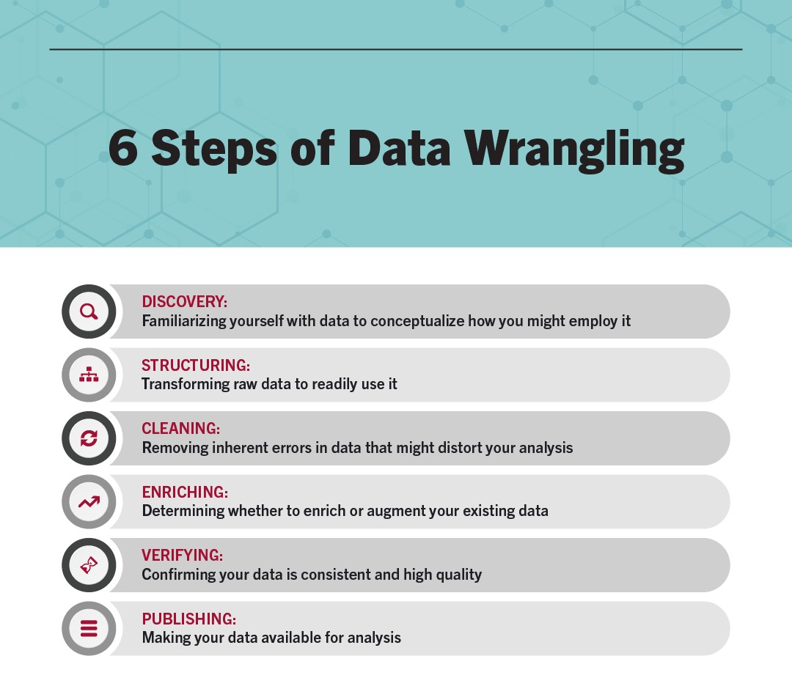
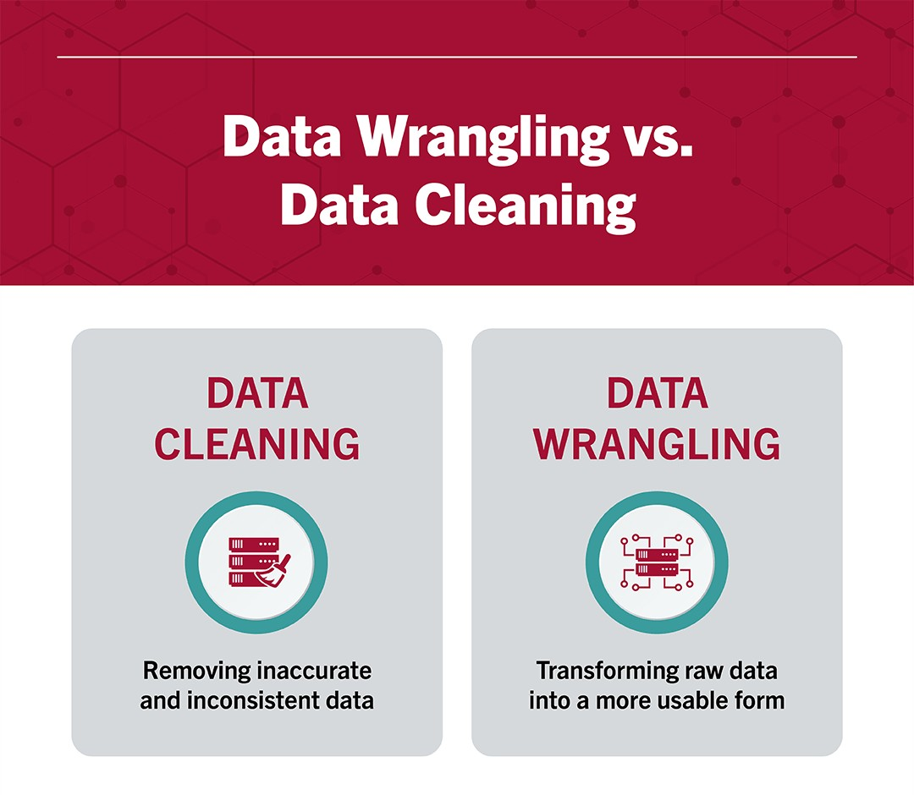

# Data Wrangling with `Pandas` and `Polars`

::: {.callout-note}
## Learning Objectives
By the end of this chapter, you should be able to:

- Understand what data wrangling is and its importance
- Import tabular accounting data (CSV) into both pandas and polars DataFrames
- Select, filter, and sort accounting data using both libraries
- Clean messy accounting data: fix currency formatting, inconsistent text, bad dates, and missing values
- Merge/join accounting tables and explain the difference between inner and left joins
- Reshape data between wide and long formats
- Group and aggregate transaction-level data into account-level summaries
- Explain lazy vs. eager evaluation in polars, and why it matters for large accounting datasets
:::


## What is Data Wrangling? 

**Data wrangling**—also called *data cleaning*, *data remediation*, or *data munging*—refers to a variety of processes designed to transform raw data into more readily used formats. The exact methods differ from project to project depending on the data you’re leveraging and the goal you’re trying to achieve [@stobierski_data_2021].

Some examples of data wrangling include:

* Merging multiple data sources into a single dataset for analysis

* Identifying gaps in data (for example, empty cells in a spreadsheet) and either filling or deleting them

* Deleting data that’s either unnecessary or irrelevant to the project you’re working on

* Identifying extreme outliers in data and either explaining the discrepancies or removing them so that analysis can take place

Data wrangling can be a manual or automated process. In scenarios where datasets are exceptionally large, automated data cleaning becomes a necessity. In organizations that employ a full data team, a data scientist or other team member is typically responsible for data wrangling. In smaller organizations, non-data professionals are often responsible for cleaning their data before leveraging it [@stobierski_data_2021].

### Data Wrangling Steps and Techniques

Each data project requires a unique approach to ensure its final dataset is reliable and accessible. That being said, several processes typically inform the approach. These are commonly referred to as data wrangling steps or activities. @fig-six-steps-data-wrangling shows the steps in Data Warngling [@stobierski_data_2021].

{#fig-six-steps-data-wrangling width=85%}

#### Discovery

Discovery refers to the process of familiarizing yourself with data so you can conceptualize how you might use it. You can liken it to looking in your refrigerator before cooking a meal to see what ingredients you have at your disposal.

During discovery, you may identify trends or patterns in the data, along with obvious issues, such as missing or incomplete values that need to be addressed. This is an important step, as it will inform every activity that comes afterward [@stobierski_data_2021].

#### Structuring

Raw data is typically unusable in its raw state because it’s either incomplete or misformatted for its intended application. Data structuring is the process of taking raw data and transforming it to be more readily leveraged. The form your data takes will depend on the analytical model you use to interpret it [@stobierski_data_2021].

#### Cleaning 

Data cleaning is the process of removing inherent errors in data that might distort your analysis or render it less valuable. Cleaning can come in different forms, including deleting empty cells or rows, removing outliers, and standardizing inputs. The goal of data cleaning is to ensure there are no errors (or as few as possible) that could influence your final analysis. Identifying and removing any bad data greatly impacts the rest of the wrangling processes [@stobierski_data_2021].

#### Enriching

Once you understand your existing data and have transformed it into a more usable state, you must determine whether you have all of the data necessary for the project at hand. If not, you may choose to enrich or augment your data by incorporating values from other datasets. For this reason, it’s important to understand what other data is available for use [@stobierski_data_2021].

If you decide that enrichment is necessary, you need to repeat the steps above for any new data.

#### Validating

Data validation refers to the process of verifying that your data is both consistent and of a high enough quality. During validation, you may discover issues you need to resolve or conclude that your data is ready to be analyzed. Validation is typically achieved through various automated processes and requires programming [@stobierski_data_2021].

#### Publishing

Once your data has been validated, you can publish it. This involves making it available to others within your organization for analysis. The format you use to share the information—such as a written report or electronic file—will depend on your data and the organization’s goals [@stobierski_data_2021].

### Data Wrangling vs. Data Cleaning

Despite the terms being used interchangeably, data wrangling and data cleaning are two different processes. It’s important to make the distinction that data cleaning is a critical step in the data wrangling process to remove inaccurate and inconsistent data. Meanwhile, data-wrangling is the overall process of transforming raw data into a more usable form [@stobierski_data_2021]. @fig-data-wrangling-vs-data-cleaning compares both. 

{#fig-data-wrangling-vs-data-cleaning width=85%}

### Importance of Data Wrangling  

Any analyses an accountant or CPA performs will ultimately be constrained by the data that informs them. If data is incomplete, unreliable, or faulty, then analyses will be too—diminishing the value of any critical insights gleaned.

Data wrangling seeks to remove that risk by ensuring data is in a reliable state before it’s analyzed and leveraged. This makes it a critical part of the analytical process.

It’s important to note that data wrangling can be time-consuming and taxing on resources, particularly when done manually. This is why many organizations institute policies and best practices that help employees streamline the data cleanup process—for example, requiring that data include certain information or be in a specific format before it’s uploaded to a database.

For this reason, it’s vital to understand the steps of the data wrangling process and the negative outcomes associated with incorrect or faulty data [@stobierski_data_2021].

## Two Tools, One Set of Concepts

This chapter teaches data wrangling using **two** Python libraries side by side: **pandas**, the long-standing standard for tabular data analysis in Python, and **polars**, a newer library built for speed on large datasets.

The good news: the underlying *concepts* — filtering, joining, grouping, reshaping — are identical no matter which library you use. Only the syntax changes. Learning both at once actually reinforces the concepts, because you'll see the same logic expressed two different ways.

| | pandas | polars |
|---|---|---|
| **Maturity** | Released 2008; the long-standing standard | Released 2020; newer, rapidly growing |
| **Performance** | Good for small-to-medium data; single-threaded by default | Built for speed; multi-threaded, memory-efficient |
| **Syntax style** | Label-based indexing (`df[df["x"] > 0]`) | Expression-based API (`pl.col("x") > 0`) |
| **Industry adoption (accounting/audit)** | Still the dominant tool in most firms and tutorials | Growing adoption, especially for large transaction datasets |
| **Lazy evaluation** | Not built in (see Dask/Modin for scaling, not covered here) | Built in — covered in this chapter |

::: {.callout-tip}
## Connect to Practice
You are very likely to encounter pandas in an internship or entry-level role today. Polars is worth learning now because its adoption is accelerating quickly, especially anywhere teams work with large general ledger exports (multi-million-row datasets), where its performance advantage becomes very noticeable.
:::

We'll use two datasets you already have from previous chapters — `general_ledger_sample.csv` and `trial_balance.csv` — plus two new ones for this chapter: `chart_of_accounts.csv` (for joins) and `messy_general_ledger.csv` (for cleaning practice).

## Reading Data In

Let's start by loading the general ledger sample into both libraries and inspecting its structure.

::: {.panel-tabset}
## pandas 
```{python}
import pandas as pd
import polars as pl

# pandas
gl_pd = pd.read_csv("data/general_ledger_sample.csv")
print(gl_pd.shape)
print(gl_pd.dtypes)
gl_pd.head(3)
```

## polars
```{python}
# polars
gl_pl = pl.read_csv("data/general_ledger_sample.csv")
print(gl_pl.shape)
print(gl_pl.dtypes)
gl_pl.head(3)
```

:::

Both libraries correctly infer that `debit` and `credit` are numeric and everything else is text. You can get quick summary statistics with `.describe()` in both libraries:

::: {.panel-tabset}
## pandas 
```{python}
gl_pd.describe()
```

## polars
```{python}
gl_pl.describe()
```

:::
### Reading with an Explicit Schema

By default, both libraries *guess* each column's data type. This usually works, but for accounting data it's good practice to be explicit — especially for ID columns that look numeric but should stay text (an `entry_id` of `1001` should never be treated as a number you could accidentally average).

::: {.panel-tabset}
## pandas 
```{python}
# pandas: force entry_id to stay text
gl_pd2 = pd.read_csv("data/general_ledger_sample.csv", dtype={"entry_id": str})
print(gl_pd2["entry_id"].dtype)
```

## polars
```{python}
# polars: same idea, using schema_overrides
gl_pl2 = pl.read_csv(
    "data/general_ledger_sample.csv",
    schema_overrides={"entry_id": pl.Utf8}
)
print(gl_pl2["entry_id"].dtype)
```

:::


::: {.callout-tip}
## Connect to Practice
Excel files are just as common as CSVs in accounting practice. Both libraries can read them directly: `pd.read_excel("file.xlsx")` and `pl.read_excel("file.xlsx")` (polars requires the `fastexcel` package, installable with `pip install fastexcel`).
:::

## Selecting, Filtering, and Sorting

### Filtering on a Single Condition

Let's find every transaction with a debit over $5,000 — a common first step in transaction testing.

::: {.panel-tabset}
## pandas 
```{python}
# pandas
large_pd = gl_pd[gl_pd["debit"] > 5000]
large_pd[["entry_id", "account", "debit"]]
```

## polars 
```{python}
# polars
large_pl = gl_pl.filter(pl.col("debit") > 5000)
large_pl.select(["entry_id", "account", "debit"])
```

:::
### Combining Multiple Conditions

Now let's narrow this to transactions in the Operations department with a nonzero debit — combining two conditions with `&` (AND).

::: {.panel-tabset}
## pandas 
```{python}
# pandas
combo_pd = gl_pd[(gl_pd["department"] == "Operations") & (gl_pd["debit"] > 0)]
combo_pd[["entry_id", "account", "debit", "department"]]
```

## polars 
```{python}
# polars
combo_pl = gl_pl.filter(
    (pl.col("department") == "Operations") & (pl.col("debit") > 0)
)
combo_pl.select(["entry_id", "account", "debit", "department"])
```

:::

::: {.callout-important}
## A Common Mistake
In pandas, you must use `&` and `|` (not Python's `and`/`or`) when combining conditions, and each condition needs its own parentheses: `(gl_pd["department"] == "Operations") & (gl_pd["debit"] > 0)`. Forgetting the parentheses is one of the most common pandas errors for beginners.
:::

### Sorting

Let's sort by debit amount (largest first), breaking ties by date (earliest first):

::: {.panel-tabset}
## pandas 
```{python}
# pandas
gl_pd.sort_values(["debit", "entry_date"], ascending=[False, True]).head()
```

## polars 
```{python}
# polars
gl_pl.sort(["debit", "entry_date"], descending=[True, False]).head()
```

:::

## Cleaning Data

Real accounting data is rarely as clean as `general_ledger_sample.csv`. Let's work through `messy_general_ledger.csv`, which has the same kinds of issues introduced in Chapter 3: currency symbols, inconsistent formatting, an impossible date, a missing value, and a likely duplicate entry.

### Step 1: Fix Currency Formatting

::: {.panel-tabset}
## pandas 
```{python}
messy_pd = pd.read_csv("data/messy_general_ledger.csv")
messy_pd
```

```{python}
# pandas
df_pd = messy_pd.copy()
for col in ["debit", "credit"]:
    df_pd[col] = (
        df_pd[col].astype(str)
        .str.replace("$", "", regex=False)
        .str.replace(",", "", regex=False)
    )
    df_pd[col] = pd.to_numeric(df_pd[col])

df_pd[["entry_id", "debit", "credit"]]
```

## polars 
```{python}
# polars
messy_pl = pl.read_csv("data/messy_general_ledger.csv")

df_pl = messy_pl.with_columns([
    pl.col("debit").str.replace_all(r"\$", "").str.replace_all(",", "").cast(pl.Float64),
    pl.col("credit").str.replace_all(r"\$", "").str.replace_all(",", "").cast(pl.Float64),
])
df_pl.select(["entry_id", "debit", "credit"])
```

::: 

The `debit` and `credit` columns contain `$` and `,` characters, which force them to be read as text instead of numbers.


### Step 2: Standardize Text Fields

The `account` and `department` columns have inconsistent capitalization and stray whitespace.

::: {.panel-tabset}
## pandas 
```{python}
# pandas
df_pd["account"] = df_pd["account"].str.strip().str.title()
df_pd["department"] = df_pd["department"].str.strip().str.title()
df_pd[["account", "department"]]
```

## polars 
```{python}
# polars
df_pl = df_pl.with_columns([
    pl.col("account").str.strip_chars().str.to_titlecase(),
    pl.col("department").str.strip_chars().str.to_titlecase(),
])
df_pl.select(["account", "department"])
```

:::

::: {.callout-warning}
## Automated Cleaning Still Needs a Human Check
Look closely at the department column: `"HR"` became `"Hr"` after title-casing, since `.title()` (and its polars equivalent) simply capitalizes the first letter of each word — it doesn't know `HR` is an acronym that should stay fully capitalized. This is a good example of why you should always spot-check the results of automated cleaning steps rather than assuming they worked perfectly. A more robust fix here would be an explicit mapping (e.g., `{"hr": "HR", "Hr": "HR"}`) for known acronyms in your data.
:::

### Step 3: Fix Inconsistent Dates

The `entry_date` column mixes `01/15/2025` and `1-15-2025` formats, and contains one impossible date (`02/30/2025` — February never has 30 days).

::: {.panel-tabset}
## pandas 
```{python}
# pandas: format="mixed" handles multiple formats; errors="coerce" turns bad dates into NaT
df_pd["entry_date"] = pd.to_datetime(df_pd["entry_date"], format="mixed", errors="coerce")
df_pd[["entry_id", "entry_date"]]
```


```{python}
# pandas: find the rows that failed to parse
df_pd[df_pd["entry_date"].isna()]
```

## polars 
Polars doesn't have an automatic "mixed format" parser, so we normalize the separators first, then parse with `strict=False` so invalid dates become `null` instead of raising an error.

```{python}
# polars
df_pl = df_pl.with_columns(
    pl.col("entry_date")
      .str.replace_all("-", "/")
      .str.to_date(format="%m/%d/%Y", strict=False)
      .alias("entry_date")
)
df_pl.select(["entry_id", "entry_date"])
```


:::

::: {.callout-important}
## What Should You Do With an Invalid Date?
Notice that `02/30/2025` became a missing value (`NaT` in pandas, `null` in polars) rather than an error that stops your code. This is intentional — but it means *you* now have to decide what to do about it: go back to the source system to find the correct date, exclude the transaction, or flag it for follow-up. Silently ignoring nulls at this point is how real errors slip through into financial reports.
:::

### Step 4: Handle Missing Values

The `department` column has one missing value.

::: {.panel-tabset}
## pandas 
```{python}
# pandas
df_pd["department"] = df_pd["department"].fillna("Unassigned")
df_pd[["entry_id", "department"]]
```

## polars 
```{python}
# polars
df_pl = df_pl.with_columns(
    pl.col("department").fill_null("Unassigned")
)
df_pl.select(["entry_id", "department"])
```

:::

### Step 5: Check for Duplicates

After cleaning, compare rows on the fields that should uniquely identify a real transaction line.

::: {.panel-tabset}
## pandas 
```{python}
# pandas
dupes_pd = df_pd[df_pd.duplicated(subset=["account", "debit", "credit"], keep=False)]
dupes_pd
```

## polars 

```{python}
dupes_pl = df_pl.filter(df_pl.is_duplicated())
dupes_pl
```

::: 


The two `JE2001` rows for `Cash` are now revealed as duplicates once formatting differences are removed — before cleaning, `"cash "` (lowercase, trailing space) looked like a different value from `"Cash"`, hiding the duplicate.

## Merging and Joining Tables

Accounting data rarely lives in a single table. Let's enrich the general ledger with account type information from `chart_of_accounts.csv`.

::: {.panel-tabset}
## pandas 
```{python}
coa_pd = pd.read_csv("data/chart_of_accounts.csv")
coa_pd.head()
```

## polars
```{python}
# polars
coa_pl = pl.read_csv("data/chart_of_accounts.csv")
```

:::


### Inner Join

An **inner join** keeps only rows where the join key (`account`) matches in *both* tables.

::: {.panel-tabset}
## pandas
```{python}
# pandas
inner_pd = gl_pd.merge(coa_pd, on="account", how="inner")
print(inner_pd.shape)
sorted(inner_pd["account"].unique())
```

## polars 
```{python}
# polars
inner_pl = gl_pl.join(coa_pl, on="account", how="inner")
print(inner_pl.shape)
```

:::
Notice the inner join result has fewer rows than the original general ledger (19 vs. 20). One account is missing.

### Left Join

A **left join** keeps *every* row from the left table (the general ledger), filling in `null`/`NaN` where there's no match in the chart of accounts.

::: {.panel-tabset}
## pandas
```{python}
# pandas
left_pd = gl_pd.merge(coa_pd, on="account", how="left")
missing_pd = left_pd[left_pd["account_number"].isna()]
missing_pd[["entry_id", "account"]].drop_duplicates()
```

## polars 
```{python}
# polars
left_pl = gl_pl.join(coa_pl, on="account", how="left")
missing_pl = left_pl.filter(pl.col("account_number").is_null())
missing_pl.select(["entry_id", "account"]).unique()
```

:::
Both approaches reveal the same finding: **"Utilities Expense"** appears in the general ledger but not in the chart of accounts — likely a new account that hasn't been added to the COA yet, or a naming mismatch (e.g., "Utilities" vs. "Utilities Expense") that needs investigation.

::: {.callout-important}
## Why This Matters
An inner join would have silently *dropped* the Utilities Expense transactions from any analysis without telling you — the row count would just be smaller, with no error or warning. A left join preserves every general ledger transaction and makes the mismatch visible. When enriching transaction data with reference tables, prefer a left join and explicitly check for unmatched rows, rather than defaulting to an inner join.
:::

## Reshaping Data

Recall the tidy data discussion from Chapter 3. Let's build a **wide** summary table — one common way accountants like to view data — and then reshape it back to **long** (tidy) format.

### Wide: Total Debits by Account and Department

::: {.panel-tabset}
## pandas

```{python}
# pandas
wide_pd = gl_pd.pivot_table(
    index="account", columns="department", values="debit",
    aggfunc="sum", fill_value=0
)
wide_pd
```

## polars 
```{python}
# polars
wide_pl = gl_pl.pivot(
    index="account", on="department", values="debit",
    aggregate_function="sum"
).fill_null(0)
wide_pl
```

:::

### Back to Long (Tidy) Format

::: {.panel-tabset}
## pandas
```{python}
# pandas
long_pd = wide_pd.reset_index().melt(
    id_vars="account", var_name="department", value_name="debit"
)
long_pd.head()
```

## polars 
```{python}
# polars
long_pl = wide_pl.unpivot(
    index="account", variable_name="department", value_name="debit"
)
long_pl.head()
```

::: 

Both directions matter in practice: the wide format is easy for a human to scan in a report, while the long/tidy format is what you want as an input to further analysis, grouping, or plotting (Chapter 6).

## Grouping and Aggregating

One of the most common accounting analytics tasks is summarizing transaction-level data into account-level totals — in other words, **rebuilding a trial balance from the general ledger.**

::: {.panel-tabset}
## pandas
```{python}
# pandas
tb_pd = gl_pd.groupby("account", as_index=False)[["debit", "credit"]].sum()
tb_pd
```

```{python}
print("Total debits:", tb_pd["debit"].sum())
print("Total credits:", tb_pd["credit"].sum())
```

## polars 
```{python}
# polars
tb_pl = (
    gl_pl.group_by("account")
    .agg([pl.col("debit").sum(), pl.col("credit").sum()])
    .sort("account")
)
tb_pl
```

::: 

Notice that total debits equal total credits ($60,250 each) — exactly what we'd expect, since this confirms the sample general ledger is internally balanced, the same check you'd run on any real trial balance.

### Multi-Level Grouping

You can group by more than one column at once — for example, account *within* department:

::: {.panel-tabset}
## pandas
```{python}
# pandas
multi_pd = gl_pd.groupby(["department", "account"], as_index=False)[["debit", "credit"]].sum()
multi_pd
```

## polars 
```{python}
# polars
multi_pl = (
    gl_pl.group_by(["department", "account"])
    .agg([pl.col("debit").sum(), pl.col("credit").sum()])
    .sort(["department", "account"])
)
multi_pl
```

::: 

## Polars Lazy Frames: Wrangling Large Accounting Datasets

Everything so far has used **eager evaluation** — each line of code runs immediately, and the result is fully computed and stored in memory before you move to the next step. This is how pandas always works, and how polars works by default with `pl.read_csv()`.

Polars also offers **lazy evaluation**: instead of running each step immediately, you build up a *query plan* describing everything you want to do, and only execute it once, at the end, with `.collect()`. This matters enormously for large datasets, because polars can look at your *entire* pipeline before running anything and optimize it — for example, reading only the columns you actually use, or applying filters before an expensive join instead of after.

### Eager vs. Lazy: The Same Pipeline, Two Ways

Let's take a realistic pipeline — filter to nonzero debits, join to the chart of accounts, then total debits by account type — and run it both ways.

```{python}
# EAGER: every step executes immediately and materializes a full result in memory
result_eager = (
    gl_pl
    .filter(pl.col("debit") > 0)
    .join(coa_pl, on="account", how="inner")
    .group_by("account_type")
    .agg(pl.col("debit").sum().alias("total_debit"))
    .sort("account_type")
)
result_eager
```

```{python}
# LAZY: scan_csv builds a query plan; nothing runs until .collect()
lazy_query = (
    pl.scan_csv("data/general_ledger_sample.csv")
    .filter(pl.col("debit") > 0)
    .join(pl.scan_csv("data/chart_of_accounts.csv"), on="account", how="inner")
    .group_by("account_type")
    .agg(pl.col("debit").sum().alias("total_debit"))
    .sort("account_type")
)

result_lazy = lazy_query.collect()
result_lazy
```

Both approaches give an identical result — but they got there differently. You can inspect *how* polars plans to execute the lazy version before running it, using `.explain()`:

```{python}
print(lazy_query.explain())
```

Look closely at the plan: notice it shows `PROJECT 3/9 COLUMNS` for the general ledger scan. Polars has figured out — entirely on its own — that only 3 of the 9 available columns are actually needed anywhere in this pipeline, and it will only read those columns from disk. It has also pushed the `debit > 0` filter down to happen *during* the file scan, rather than loading the full dataset first and filtering afterward.

::: {.callout-important}
## Why This Matters for Real Accounting Data
A university dataset like `general_ledger_sample.csv` has 20 rows — the difference between eager and lazy evaluation is invisible here. But a real company's general ledger for a single fiscal year can easily contain **millions of transaction lines** across dozens of columns. In that setting:

- Reading only the 3 needed columns instead of all 9 can cut memory use dramatically
- Filtering before a join (rather than joining everything, then filtering) avoids doing expensive join work on rows you're about to discard anyway
- These optimizations happen **automatically** once you write your pipeline in lazy form — you don't have to manually reorder your steps for performance

This is precisely the kind of workload common in audit analytics (Chapter 8) and fraud detection (Chapter 9), where you may need to scan an entire year of transactions rather than a sample. Lazy evaluation is one reason polars is gaining adoption for exactly this kind of large-scale accounting analytics work.
:::

::: {.callout-tip}
## A Note on Pandas and Scale
Pandas itself doesn't have a lazy evaluation mode. For very large datasets in a pandas-based workflow, teams sometimes turn to libraries like **Dask** or **Modin**, which mimic the pandas API while distributing computation — these are beyond the scope of this book, but worth knowing the names of if you encounter a pandas dataset too large to fit comfortably in memory.
:::

## Chapter Summary

- pandas and polars share the same core wrangling concepts — filtering, sorting, cleaning, joining, reshaping, grouping — but express them with different syntax; pandas remains the current industry standard, while polars is a fast-growing alternative especially suited to large datasets.
- Cleaning real accounting data typically involves fixing currency formatting, standardizing inconsistent text, parsing unreliable dates, filling missing values, and checking for duplicates — and automated cleaning steps (like `.title()`) still need a human sanity check.
- Inner joins silently drop unmatched rows; left joins preserve every row from your primary table and reveal mismatches — prefer left joins when enriching transaction data with a reference table like a chart of accounts.
- Reshaping between wide (human-readable) and long/tidy (analysis-ready) formats is a routine step, supported in both libraries via pivot/melt (pandas) and pivot/unpivot (polars).
- Grouping and aggregating transaction-level data lets you rebuild summary views — like a trial balance — directly from the general ledger, and is a natural way to sanity-check that debits equal credits.
- Polars' lazy evaluation (`pl.scan_csv()` + `.collect()`) lets the library optimize an entire pipeline before running it — reading only needed columns and pushing filters earlier — which becomes increasingly valuable as accounting datasets grow into the millions of rows.

## Discussion Questions

1. Why might an inner join be the *wrong* default choice when enriching general ledger transactions with chart-of-accounts data, even though it produces a "cleaner-looking" result with fewer rows to review?
2. The `.title()` cleaning step turned `"HR"` into `"Hr"`. Can you think of another accounting example (an account name, a department, an abbreviation) where automatic text cleaning could introduce a *new* error while fixing another?
3. In your own words, explain why lazy evaluation matters more for a company with millions of general ledger transactions than for the 20-row sample used in this chapter.

## Exercises

1. Load `general_ledger_sample.csv` in both pandas and polars, and confirm both libraries produce the same total debits and total credits when grouped by account.
2. Using `messy_general_ledger.csv`, complete the full cleaning workflow (currency formatting, text standardization, dates, missing values, duplicates) in whichever library you're more comfortable with, then repeat it in the other library.
3. Using `chart_of_accounts.csv` and `general_ledger_sample.csv`, perform a left join and identify every general ledger account with no chart-of-accounts match. Write one sentence describing what you'd do next if this were a real client engagement.
4. Rewrite the eager pipeline in the Lazy Frames section as your own lazy pipeline, but group by `department` instead of `account_type`. Run `.explain()` on your version and describe, in your own words, what optimization(s) you can identify in the output.
