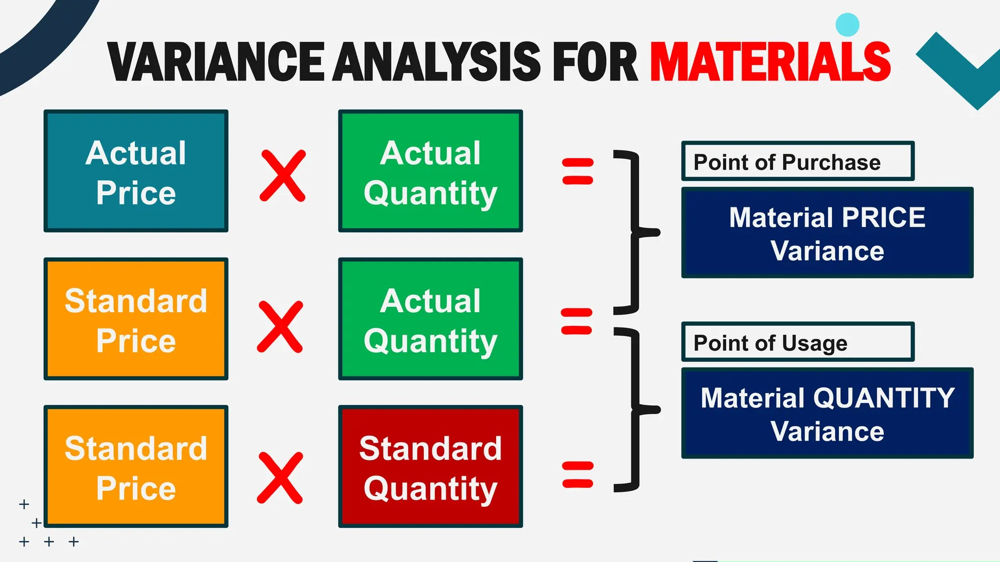
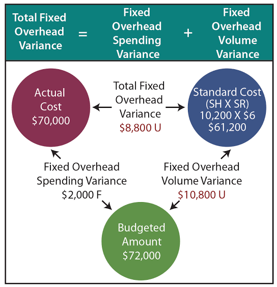

# Management Accounting Analytics

::: {.callout-note}
## Learning Objectives
By the end of this chapter, you should be able to:

- Distinguish management accounting analytics from the financial accounting analytics covered in Chapter 7
- Compute and interpret standard costing variances for materials, labor, and overhead
- Perform cost-volume-profit (CVP) analysis, including break-even point, margin of safety, and target profit
- Compare traditional overhead allocation to activity-based costing (ABC), and explain when the two produce meaningfully different product costs
- Build management-facing visualizations for internal decision-making
- Perform all of the above using both pandas and polars, and visualize results with both seaborn and plotnine
:::

## Financial vs. Management Accounting Analytics

Chapter 7 analyzed financial statements the way an outside investor or lender would: ratios computed from GAAP-based, externally reported numbers, governed by accounting standards and audited for accuracy. **Management accounting** serves a different audience entirely — the people running the business day to day — and follows different rules, or more precisely, no externally mandated rules at all. A budget variance report, a break-even analysis, or an internal product costing model never gets filed with the SEC or audited by an external firm; it exists purely to help managers make better decisions, which means it can be structured however is most useful internally.

This chapter covers three of the most common management accounting analytics tasks: **standard costing variance analysis** (did we spend what we expected to, and why not?), **cost-volume-profit analysis** (how many units do we need to sell to be profitable?), and **activity-based costing** (are we allocating overhead to products in a way that reflects how they actually consume resources?).

We'll use a fictional manufacturer's data: `manufacturing_variance_data.csv` (12 months of standard costing detail), `cvp_monthly_data.csv` (monthly unit economics), and `abc_cost_data.csv` (a five-product overhead allocation comparison).

::: {.panel-tabset}
## pandas
```{python}
import pandas as pd
variance_pd = pd.read_csv("data/manufacturing_variance_data.csv")
variance_pd.head()
```

## polars 

```{python}
import polars as pl
variance_pl = pl.read_csv("data/manufacturing_variance_data.csv")
variance_pl.head()
```


:::


## Standard Costing Variance Analysis

A **standard cost** is the cost a company *expects* to incur per unit under normal, efficient operating conditions — a predetermined benchmark set before the period begins. Comparing actual costs to this standard, and breaking the difference into specific causes, is the foundation of management accounting's cost control toolkit.

### Materials Variances

The total difference between actual and standard materials cost splits into two independent causes: did we pay a different **price** per unit of material, and did we use a different **quantity** than the standard allows for the output we actually produced? @fig-materials-variance shows the total material variance.

{#fig-materials-variance}

::: {.panel-tabset}
## pandas
```{python}
# Materials price variance = (Actual Price - Standard Price) x Actual Quantity
variance_pd["materials_price_variance"] = (
    (variance_pd["actual_materials_price"] - variance_pd["std_materials_price"])
    * variance_pd["actual_materials_qty_total"]
)

# Materials quantity variance = (Actual Qty - Standard Qty Allowed) x Standard Price
variance_pd["std_qty_allowed"] = variance_pd["std_materials_qty_per_unit"] * variance_pd["units_produced"]
variance_pd["materials_qty_variance"] = (
    (variance_pd["actual_materials_qty_total"] - variance_pd["std_qty_allowed"])
    * variance_pd["std_materials_price"]
)

variance_pd[["month", "materials_price_variance", "materials_qty_variance"]].round(0)
```

## polars
```{python}
variance_pl = variance_pl.with_columns([
    ((pl.col("actual_materials_price") - pl.col("std_materials_price")) * pl.col("actual_materials_qty_total"))
        .alias("materials_price_variance"),
    (pl.col("std_materials_qty_per_unit") * pl.col("units_produced")).alias("std_qty_allowed"),
]).with_columns(
    ((pl.col("actual_materials_qty_total") - pl.col("std_qty_allowed")) * pl.col("std_materials_price"))
        .alias("materials_qty_variance")
)

variance_pl.select(["month", "materials_price_variance", "materials_qty_variance"])
```
:::

::: {.callout-tip}
## Reading Variance Signs
By convention, a **positive** variance here means actual cost exceeded standard cost — **unfavorable**. A **negative** variance means actual cost was less than standard — **favorable**. This convention (rather than always reporting an absolute value) preserves the direction of the difference, which is exactly the information a manager needs to know whether to investigate a problem or recognize an improvement.
:::

```{python}
print("Annual materials price variance:", round(variance_pd["materials_price_variance"].sum(), 0))
print("Annual materials quantity variance:", round(variance_pd["materials_qty_variance"].sum(), 0))
```

The materials **price** variance is unfavorable by about $13,600 for the year — actual material prices ran above standard, consistent with a gradual price increase over the year. The materials **quantity** variance is a smaller unfavorable $2,700 — usage was close to standard, with only modest waste.

### Labor Variances

Labor variances follow the same logic: a **rate** variance (did we pay a different wage than standard?) and an **efficiency** variance (did it take more or fewer hours than standard for the output produced?).

::: {.panel-tabset}
## pandas
```{python}
variance_pd["labor_rate_variance"] = (
    (variance_pd["actual_labor_rate"] - variance_pd["std_labor_rate"]) * variance_pd["actual_labor_hours_total"]
)

variance_pd["std_hours_allowed"] = variance_pd["std_labor_hours_per_unit"] * variance_pd["units_produced"]
variance_pd["labor_efficiency_variance"] = (
    (variance_pd["actual_labor_hours_total"] - variance_pd["std_hours_allowed"]) * variance_pd["std_labor_rate"]
)

variance_pd[["month", "labor_rate_variance", "labor_efficiency_variance"]].round(0)
```

## polars
```{python}
variance_pl = variance_pl.with_columns([
    ((pl.col("actual_labor_rate") - pl.col("std_labor_rate")) * pl.col("actual_labor_hours_total"))
        .alias("labor_rate_variance"),
    (pl.col("std_labor_hours_per_unit") * pl.col("units_produced")).alias("std_hours_allowed"),
]).with_columns(
    ((pl.col("actual_labor_hours_total") - pl.col("std_hours_allowed")) * pl.col("std_labor_rate"))
        .alias("labor_efficiency_variance")
)

variance_pl.select(["month", "labor_rate_variance", "labor_efficiency_variance"])
```
:::

```{python}
print("Annual labor rate variance:", round(variance_pd["labor_rate_variance"].sum(), 0))
print("Annual labor efficiency variance:", round(variance_pd["labor_efficiency_variance"].sum(), 0))
```

The labor **efficiency** variance is favorable by roughly $30,600 — the workforce is completing units in meaningfully fewer hours than the standard allows, consistent with a learning-curve effect as workers become more practiced over the year. This is the single largest variance in the whole dataset, and it's favorable — a genuinely positive operational story.

### Overhead Variances

Overhead variances measure the difference between actual manufacturing overhead costs and **applied** standard costs. Variable overhead splits into *spending* and *efficiency* variances based on activity levels. Variable overhead variances are very similar in terms of computation to materials and labor variances. Fixed overhead splits into spending (budget) and volume variances based on capacity and production.

$$\small \text{VC Spending Variance} = \text{Actual Hours} \times (\text{Actual Rate} - \text{Standard Rate})$$

$$\small \text{VC Efficiency Variance} = \text{Standard Rate} \times (\text{Actual Hours} - \text{Standard Hours})$$

Fixed overhead costs remain constant in total regardless of changes in production volume within a relevant range. @fig-overhead-variance shows total fixed cost overhead variance breakdown.

{#fig-overhead-variance}

```{python}
variance_pd["var_oh_applied"] = variance_pd["actual_labor_hours_total"] * variance_pd["std_var_oh_rate_per_labor_hr"]
variance_pd["var_oh_spending_variance"] = variance_pd["actual_var_oh_total"] - variance_pd["var_oh_applied"]
variance_pd["fixed_oh_budget_variance"] = variance_pd["actual_fixed_oh"] - variance_pd["budgeted_fixed_oh"]

print("Annual variable overhead spending variance:", round(variance_pd["var_oh_spending_variance"].sum(), 0))
print("Annual fixed overhead budget variance:", round(variance_pd["fixed_oh_budget_variance"].sum(), 0))
```

### Visualizing the Full Variance Picture

```{python}
variance_summary = pd.DataFrame({
    "variance": ["Materials Price", "Materials Quantity", "Labor Rate", "Labor Efficiency"],
    "amount": [
        variance_pd["materials_price_variance"].sum(),
        variance_pd["materials_qty_variance"].sum(),
        variance_pd["labor_rate_variance"].sum(),
        variance_pd["labor_efficiency_variance"].sum(),
    ],
})
variance_summary["type"] = variance_summary["amount"].apply(lambda x: "Unfavorable" if x > 0 else "Favorable")
```

::: {.panel-tabset}
## seaborn
```{python}
import seaborn as sns
import matplotlib.pyplot as plt

plt.figure(figsize=(7, 4.5))
sns.barplot(
    data=variance_summary, x="amount", y="variance", hue="type",
    palette={"Unfavorable": "#c9482f", "Favorable": "#1c7c73"}
)
plt.title("Annual Standard Costing Variances")
plt.xlabel("Variance ($)")
plt.axvline(0, color="black", linewidth=0.8)
plt.tight_layout()
plt.show()
```

## plotnine
```{python}
from plotnine import *

(
    ggplot(variance_summary, aes(x="reorder(variance, amount)", y="amount", fill="type"))
    + geom_col()
    + coord_flip()
    + scale_fill_manual(values={"Unfavorable": "#c9482f", "Favorable": "#1c7c73"})
    + labs(title="Annual Standard Costing Variances", x="", y="Variance ($)", fill="")
    + theme_minimal()
)
```
:::

::: {.callout-important}
## Reading the Full Picture Together
No single variance tells the whole story. Rising material prices (unfavorable) are being more than offset by a strong labor efficiency gain (favorable) — a pattern only visible by looking at all four variances side by side. A manager who only reviewed the materials price variance might conclude the year was purely a story of rising input costs, missing the larger, favorable efficiency story happening in labor. This is the same lesson from Chapter 7's DuPont analysis: a single number in isolation can mislead, and decomposition reveals the real drivers.
:::

## Cost-Volume-Profit (CVP) Analysis

CVP analysis answers a different question: given our **cost structure**^[Cost structure refers to the proportion of variable and fixed cost in total cost. For example, if total cost is $100, variable cost could be $40 and fixed cost then is $60 or vice versa. Then, cost structure is variable cost is 40% and fixed cost is 60%. Cost structure has critical implications while managers make decisions.], how many units do we need to sell to break even, and how much cushion do we currently have above that point?

::: {.panel-tabset}
## pandas
```{python}
cvp_pd = pd.read_csv("data/cvp_monthly_data.csv")
cvp_pd.head()
```

## polars 

```{python}
cvp_pl = pl.read_csv("data/cvp_monthly_data.csv")
cvp_pl.head()
```
:::
### Contribution Margin and Break-Even

The **contribution margin per unit** represents the amount of money each individual item sold contributes toward covering your company's fixed costs. It isolates profitability at the product level by stripping away fixed constraints, subtracting only the variable costs—such as raw materials, direct labor, and sales commissions—from the unit's selling price.

The **contribution margin ratio** expresses your profit margins as a clean percentage of total sales revenue rather than a flat dollar amount. By dividing the contribution margin by total sales, you instantly see what percentage of each dollar generated is available to pay down fixed overhead and fund bottom-line profits. This ratio is a vital tool for managers forecasting profitability, as it allows you to quickly calculate how a sudden 10% increase or decrease in gross sales volume will mathematically impact net income.

The **break-even point in units** calculates the exact physical quantity of product your business must manufacture and sell to achieve a net income of zero. To find this number, total fixed costs are divided by the contribution margin per unit, revealing the baseline production target required to avoid losing money. Tracking this metric gives operations managers a clear, tangible daily or monthly sales quota that production teams must hit before the business can claim true profitability.

The **break-even point in dollars** translates your operational baseline into a concrete financial revenue target, dictating the total sales volume needed to perfectly balance the books. By dividing total fixed costs by the *contribution margin ratio*, this formula determines the gross cash inflow required to cover all combined variable and fixed expenses. This dollar-centric metric is highly prized by executives and lenders, as it provides a universal benchmark to evaluate financial risk and measure safety margins against actual sales forecasts.


The **Margin of Safety (or safety margin)** is a financial metric that measures the cushion a business has between its current or projected sales volume and its break-even point. It represents the amount by which sales can drop before the business begins to lose money, serving as a critical indicator of financial risk. A high margin of safety means the business is well-protected against economic downturns or sales drops, while a low margin indicates high risk.


$$
\begin{split}
\text{Contribution Margin per Unit} = & \text{Selling Price per Unit} \\
& - \text{Variable Cost per Unit}
\end{split}
$$


$$
\begin{split}
\text{Contribution Margin Ratio} = & \frac{\text{Contribution Margin per Unit}}{\text{Selling Price per Unit}}
\end{split}
$$


$$
\begin{split}
\text{Break-Even Point (Units)} = & \frac{\text{Fixed Costs}}{\text{Contribution Margin per Unit}}
\end{split}
$$


$$
\begin{split}
\text{Break-Even Point (Dollars)} = & \frac{\text{Fixed Costs}}{\text{Contribution Margin Ratio}}
\end{split}
$$

$$
\begin{split}
\text{Margin of Safety (Dollars)} = & \text{Current or Budgeted Sales} \\
& - \text{Break-Even Sales}
\end{split}
$$
$$
\begin{split}
\text{Margin of Safety (Units)} = & \text{Current or Budgeted Units Sold} \\
& - \text{Break-Even Units}
\end{split}
$$
$$
\begin{split}
\text{Margin of Safety Percentage} = & \frac{\text{Margin of Safety (Dollars)}}{\text{Current or Budgeted Sales}} \times 100
\end{split}
$$


::: {.panel-tabset}
## pandas
```{python}
cvp_pd["contribution_margin_per_unit"] = cvp_pd["selling_price_per_unit"] - cvp_pd["variable_cost_per_unit"]
cvp_pd["cm_ratio"] = cvp_pd["contribution_margin_per_unit"] / cvp_pd["selling_price_per_unit"]
cvp_pd["breakeven_units"] = cvp_pd["fixed_costs"] / cvp_pd["contribution_margin_per_unit"]
cvp_pd["margin_of_safety_pct"] = (cvp_pd["units_sold"] - cvp_pd["breakeven_units"]) / cvp_pd["units_sold"] * 100

cvp_pd[["month", "contribution_margin_per_unit", "cm_ratio", "breakeven_units", "margin_of_safety_pct"]].round(2)
```

## polars
```{python}
cvp_pl = cvp_pl.with_columns([
    (pl.col("selling_price_per_unit") - pl.col("variable_cost_per_unit")).alias("contribution_margin_per_unit"),
]).with_columns([
    (pl.col("contribution_margin_per_unit") / pl.col("selling_price_per_unit")).alias("cm_ratio"),
    (pl.col("fixed_costs") / pl.col("contribution_margin_per_unit")).alias("breakeven_units"),
]).with_columns(
    ((pl.col("units_sold") - pl.col("breakeven_units")) / pl.col("units_sold") * 100).alias("margin_of_safety_pct")
)

cvp_pl.select(["month", "contribution_margin_per_unit", "cm_ratio", "breakeven_units", "margin_of_safety_pct"])
```
:::

The contribution margin ratio sits consistently around 30-33%, and the margin of safety — how far actual sales exceed the break-even point — ranges from roughly 24% to 46% across months. Every month in this dataset operated safely above break-even, but with meaningfully more cushion in some months (June, September) than others (January, May).

### The Break-Even Chart

```{python}
import numpy as np

avg_price = cvp_pd["selling_price_per_unit"].mean()
avg_vc = cvp_pd["variable_cost_per_unit"].mean()
avg_fc = cvp_pd["fixed_costs"].mean()
breakeven_units = avg_fc / (avg_price - avg_vc)

units_range = np.linspace(0, 6000, 100)
be_df = pd.DataFrame({
    "units": units_range,
    "revenue": units_range * avg_price,
    "total_cost": avg_fc + units_range * avg_vc,
})
```

::: {.panel-tabset}
## seaborn
```{python}
plt.figure(figsize=(7, 5))
plt.plot(be_df["units"], be_df["revenue"], label="Revenue", color="#1c7c73")
plt.plot(be_df["units"], be_df["total_cost"], label="Total Cost", color="#c9482f")
plt.axvline(breakeven_units, linestyle="--", color="gray", label=f"Break-even ({breakeven_units:.0f} units)")
plt.title("Cost-Volume-Profit (Break-Even) Chart")
plt.xlabel("Units")
plt.ylabel("Dollars ($)")
plt.legend()
plt.tight_layout()
plt.show()
```

## plotnine
```{python}
be_long = be_df.melt(id_vars="units", value_vars=["revenue", "total_cost"], var_name="line", value_name="dollars")

(
    ggplot(be_long, aes(x="units", y="dollars", color="line"))
    + geom_line(size=1)
    + geom_vline(xintercept=breakeven_units, linetype="dashed", color="gray")
    + scale_color_manual(values={"revenue": "#1c7c73", "total_cost": "#c9482f"})
    + labs(title="Cost-Volume-Profit (Break-Even) Chart", x="Units", y="Dollars ($)", color="")
    + theme_minimal()
)
```
:::

The break-even point sits at roughly 2,570 units per month — well below every month's actual sales volume in this dataset (all above 3,700 units), consistent with the healthy margin of safety percentages computed above.

### Target Profit Analysis

CVP logic extends naturally to a different question: how many units are needed to hit a specific profit target, not just to break even?

```{python}
target_profit = 30000
target_units = (avg_fc + target_profit) / (avg_price - avg_vc)
print(f"Units needed for a ${target_profit:,} monthly target profit: {target_units:.0f}")
```

## Activity-Based Costing (ABC)

Traditional overhead allocation spreads all manufacturing overhead across products using a single base — often machine hours or direct labor hours. This works reasonably well when products consume overhead resources in **roughly the same proportions**. When products differ substantially in complexity, it can systematically distort product costs.

::: {.panel-tabset}
## pandas
```{python}
products_pd = pd.read_csv("data/abc_cost_data.csv")
products_pd[["product", "units_produced", "machine_hours", "num_setups", "num_inspections"]]
```

## polars

```{python}
products_pl = pl.read_csv("data/abc_cost_data.csv")
products_pl.select(["product", "units_produced", "machine_hours", "num_setups", "num_inspections"])
```

:::
Notice the pattern: **Standard-A** and **Standard-B** are produced in large volumes with relatively few setups or inspections per unit — simple, high-volume products. **Custom-C**, **Custom-D**, and **Specialty-E** are produced in much smaller volumes but require a disproportionate number of setups and inspections — complex, low-volume products.

### Traditional Allocation (Single Base: Machine Hours)

::: {.panel-tabset}
## pandas
```{python}
TOTAL_OVERHEAD = 300_000

trad_rate_per_mh = TOTAL_OVERHEAD / products_pd["machine_hours"].sum()
products_pd["traditional_oh_allocated"] = products_pd["machine_hours"] * trad_rate_per_mh

products_pd[["product", "machine_hours", "traditional_oh_allocated"]].round(0)
```

## polars
```{python}
total_machine_hours = products_pl.select(pl.col("machine_hours").sum()).item()
trad_rate_per_mh_pl = TOTAL_OVERHEAD / total_machine_hours

products_pl = products_pl.with_columns(
    (pl.col("machine_hours") * trad_rate_per_mh_pl).alias("traditional_oh_allocated")
)

products_pl.select(["product", "machine_hours", "traditional_oh_allocated"])
```
:::

### Activity-Based Allocation (Three Cost Pools)

ABC instead splits overhead into pools tied to specific activities, each allocated using the cost driver that actually causes that cost — setups, inspections, and machine time each get their own rate.

::: {.panel-tabset}
## pandas
```{python}
setup_pool, inspection_pool, machine_pool = TOTAL_OVERHEAD * 0.35, TOTAL_OVERHEAD * 0.25, TOTAL_OVERHEAD * 0.40

setup_rate = setup_pool / products_pd["num_setups"].sum()
inspection_rate = inspection_pool / products_pd["num_inspections"].sum()
machine_rate = machine_pool / products_pd["machine_hours"].sum()

products_pd["abc_setup_cost"] = products_pd["num_setups"] * setup_rate
products_pd["abc_inspection_cost"] = products_pd["num_inspections"] * inspection_rate
products_pd["abc_machine_cost"] = products_pd["machine_hours"] * machine_rate
products_pd["abc_oh_allocated"] = (
    products_pd["abc_setup_cost"] + products_pd["abc_inspection_cost"] + products_pd["abc_machine_cost"]
)

products_pd[["product", "abc_setup_cost", "abc_inspection_cost", "abc_machine_cost", "abc_oh_allocated"]].round(0)
```

## polars
```{python}
setup_pool_pl, inspection_pool_pl, machine_pool_pl = TOTAL_OVERHEAD * 0.35, TOTAL_OVERHEAD * 0.25, TOTAL_OVERHEAD * 0.40

setup_rate_pl = setup_pool_pl / products_pl.select(pl.col("num_setups").sum()).item()
inspection_rate_pl = inspection_pool_pl / products_pl.select(pl.col("num_inspections").sum()).item()
machine_rate_pl = machine_pool_pl / products_pl.select(pl.col("machine_hours").sum()).item()

products_pl = products_pl.with_columns([
    (pl.col("num_setups") * setup_rate_pl).alias("abc_setup_cost"),
    (pl.col("num_inspections") * inspection_rate_pl).alias("abc_inspection_cost"),
    (pl.col("machine_hours") * machine_rate_pl).alias("abc_machine_cost"),
]).with_columns(
    (pl.col("abc_setup_cost") + pl.col("abc_inspection_cost") + pl.col("abc_machine_cost")).alias("abc_oh_allocated")
)

products_pl.select(["product", "abc_setup_cost", "abc_inspection_cost", "abc_machine_cost", "abc_oh_allocated"])
```
:::

Both methods allocate the same $300,000 total — the only question is *how* it's distributed across the five products.

```{python}
products_pd["traditional_cost_per_unit"] = (
    products_pd["direct_materials_cost"] + products_pd["direct_labor_cost"] + products_pd["traditional_oh_allocated"]
) / products_pd["units_produced"]

products_pd["abc_cost_per_unit"] = (
    products_pd["direct_materials_cost"] + products_pd["direct_labor_cost"] + products_pd["abc_oh_allocated"]
) / products_pd["units_produced"]

products_pd["cost_per_unit_difference"] = products_pd["abc_cost_per_unit"] - products_pd["traditional_cost_per_unit"]
products_pd[["product", "traditional_cost_per_unit", "abc_cost_per_unit", "cost_per_unit_difference"]].round(2)
```

::: {.panel-tabset}
## seaborn
```{python}
comparison = products_pd.melt(
    id_vars="product", value_vars=["traditional_cost_per_unit", "abc_cost_per_unit"],
    var_name="method", value_name="cost_per_unit"
)
comparison["method"] = comparison["method"].map({
    "traditional_cost_per_unit": "Traditional", "abc_cost_per_unit": "ABC"
})

plt.figure(figsize=(8, 4.5))
sns.barplot(data=comparison, x="product", y="cost_per_unit", hue="method",
            palette={"Traditional": "#8a4fbe", "ABC": "#1c7c73"})
plt.title("Cost per Unit: Traditional vs. Activity-Based Costing")
plt.ylabel("Cost per Unit ($)")
plt.tight_layout()
plt.show()
```

## plotnine
```{python}
(
    ggplot(comparison, aes(x="product", y="cost_per_unit", fill="method"))
    + geom_col(position="dodge")
    + scale_fill_manual(values={"Traditional": "#8a4fbe", "ABC": "#1c7c73"})
    + labs(title="Cost per Unit: Traditional vs. Activity-Based Costing", x="", y="Cost per Unit ($)", fill="")
    + theme_minimal()
)
```
:::

::: {.callout-important}
## The Classic ABC Finding, Reproduced Here
Look at the direction of every difference: **Standard-A** and **Standard-B** — the high-volume, simple products — cost *less* per unit under ABC than under traditional allocation. **Custom-C**, **Custom-D**, and especially **Specialty-E** — the low-volume, complex products — cost dramatically *more* per unit under ABC, with Specialty-E's cost increasing by nearly $111 per unit.

This is precisely the textbook ABC finding: traditional single-base allocation systematically **undercosts** low-volume, complex products (since they don't consume much machine time, even though they generate disproportionate setup and inspection activity) while **overcosting** high-volume, simple products. A company pricing Specialty-E based on its traditional-costing number could be selling it at a loss without realizing it — exactly the kind of decision-relevant insight management accounting analytics is meant to surface.
:::

## Chapter Summary

- Management accounting analytics serves internal decision-makers rather than external stakeholders, and isn't bound by GAAP or subject to external audit — its only test is whether it helps managers make better decisions.
- Standard costing variances decompose the gap between actual and expected cost into specific, actionable causes: price/rate variances (did we pay more or less?) and quantity/efficiency variances (did we use more or less than the standard allows?).
- No single variance should be read in isolation — in this chapter, a real cost increase (materials price) was more than offset by a real efficiency gain (labor), a pattern only visible when every variance is viewed together.
- CVP analysis (contribution margin, break-even point, margin of safety, target profit) answers different but related operational questions than variance analysis, focused on volume and profitability rather than cost control.
- Traditional overhead allocation and activity-based costing can produce meaningfully different product costs whenever products vary substantially in production complexity — ABC's multiple cost-driver approach corrects for a bias that a single allocation base cannot.
- Every technique in this chapter was implemented in both pandas and polars, and visualized in both seaborn and plotnine, following the same dual-tooling approach used throughout this book.

## Discussion Questions

1. The labor efficiency variance was the largest single variance in this chapter, and it was favorable. What follow-up questions would you want answered before concluding this reflects genuine, sustainable operational improvement rather than, say, a one-time factor?
2. If a manager only reviewed the materials price variance without also looking at the labor efficiency variance, what incorrect conclusion might they draw about the year's cost performance?
3. Specialty-E's cost per unit rises by nearly $111 under ABC. If this company had been pricing Specialty-E based on the traditional cost figure, what business risk does that create, and what would you recommend management do next?

## Exercises

1. Recompute the fixed overhead **volume variance** (the difference between budgeted fixed overhead and fixed overhead applied based on standard hours allowed for actual production) — a variance not covered in this chapter — using `manufacturing_variance_data.csv`.
2. Using `cvp_monthly_data.csv`, calculate the sales volume (in units) needed to increase monthly target profit by 20% compared to this chapter's $30,000 example, and explain whether that volume looks achievable given the historical range of `units_sold` in the dataset.
3. Add a sixth, hypothetical product to `abc_cost_data.csv` with very high volume but also very high setup/inspection activity (unlike any current product). Recompute both traditional and ABC costs for it — does the usual "high volume means ABC lowers cost" pattern still hold?
4. Using either pandas or polars, calculate each product's **overhead allocation as a percentage of total cost** under both traditional and ABC methods. Which product's overhead percentage changes the most, and does that match your intuition from the cost-per-unit chart in this chapter?
