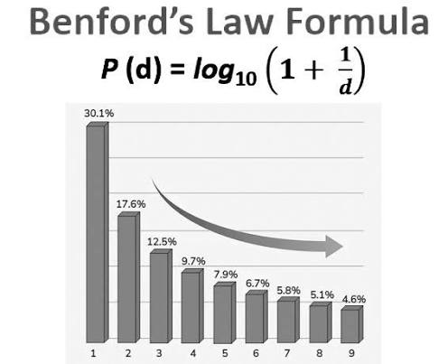

# Audit Analytics


::: {.callout-note}
## Learning Objectives
By the end of this chapter, you should be able to:

- Apply Benford's Law as a first-digit test on transaction amounts, and correctly interpret what a deviation does and doesn't tell you
- Design and run common journal entry tests: weekend postings, round-dollar amounts, period-end cutoff timing, duplicate entries, and unusual posting activity
- Explain and implement simple random, systematic, stratified, and monetary unit sampling
- Combine multiple red flags into a composite risk score to prioritize audit review
- Interpret analytics output the way an auditor would: as a starting point for investigation, not a final verdict
:::

## From EDA to Audit Testing

Chapter 1 introduced the idea that modern audits increasingly test **entire populations** of transactions rather than small manual samples. This chapter turns that idea into practice, applying the EDA techniques from Chapter 5 (distributions, outliers) and the visualization skills from Chapter 6 to a specifically audit-oriented set of tests.

We'll use two datasets in this chapter:

- `general_ledger_large.csv` (from Chapter 5) — 752 transactions, useful for Benford's Law (which needs a reasonably large sample) and for demonstrating sampling techniques
- `audit_test_transactions.csv` (new) — a smaller, purpose-built set of 117 journal entries with several deliberately embedded red flags, used for journal entry testing and red-flag scoring

:::{.panel-tabset}
## pandas 
```{python}
import pandas as pd
import numpy as np

gl = pd.read_csv("data/general_ledger_large.csv")
audit_gl = pd.read_csv("data/audit_test_transactions.csv")
audit_gl["entry_date"] = pd.to_datetime(audit_gl["entry_date"])

print(gl.shape, audit_gl.shape)
```

## polars 

```{python}
import polars as pl 

gl_pl = pl.read_csv("data/general_ledger_large.csv")
audit_gl_pl = pl.read_csv("data/audit_test_transactions.csv")
audit_gl_pl = audit_gl_pl.with_columns(
    pl.col("entry_date").str.to_date())
```

:::
## Benford's Law^[It is also called First Digit Law]

**Benford's Law** describes the relative frequency distribution for leading digits of numbers in datasets. Leading digits with smaller values occur more frequently than larger values, meaning that in many naturally occurring datasets, the leading digit of numbers is not uniformly distributed — the digit 1 appears as the first digit about 30% of the time, far more often than 9 (which appears about 4.6% of the time). Significant deviations from this expected pattern are sometimes used as a red flag for further investigation, particularly in datasets of financial transaction amounts.

Analysis of datasets shows that many data follow Benford’s law. For example, analysts have found that stock prices, population numbers, death rates, sports statistics, TikTok likes, financial and tax information, and billing amounts often have leading digits that follow this distribution. @fig-benford-law shows the distribution of first digit number in Benford's Law.   

{#fig-benford-law}

:::{.panel-tabset}
## pandas 
```{python}
debit = gl[gl["debit"] > 0]["debit"]

# extract the first significant digit of each amount
first_digits = (
    debit.astype(str)
    .str.replace(".", "", regex=False)
    .str.lstrip("0")
    .str[0]
    .astype(int)
)

observed = first_digits.value_counts(normalize=True).sort_index()

benford_expected = pd.Series({d: np.log10(1 + 1/d) for d in range(1, 10)})

comparison = pd.DataFrame({"Observed": observed, "Benford Expected": benford_expected})
comparison.round(3)
```

## polars 

```{python}
import polars as pl
import math

# Filter positive debit amounts
debit_pl = gl_pl.filter(
    pl.col("debit") > 0
)

# Extract the first significant digit
first_digits_pl = (
    debit_pl
    .select(
        pl.col("debit")
        .cast(pl.String)
        .str.replace(".", "", literal=True)
        .str.strip_chars_start("0")
        .str.slice(0, 1)
        .cast(pl.Int8)
        .alias("first_digit")
    )
)

# Observed proportions
observed_pl = (
    first_digits_pl
    .group_by("first_digit")
    .len()
    .with_columns(
        (pl.col("len") / pl.col("len").sum()).alias("Observed")
    )
    .select("first_digit", "Observed")
    .sort("first_digit")
)

# Benford expected proportions
benford_expected_pl = pl.DataFrame({
    "first_digit": list(range(1, 10)),
    "Benford Expected": [math.log10(1 + 1 / d) for d in range(1, 10)]
})

# Combine the two tables
comparison_pl = (
    observed_pl
    .join(benford_expected_pl, on="first_digit", how="outer")
    .sort("first_digit")
    .with_columns(
        pl.exclude("first_digit").round(3)
    )
)

comparison_pl
```

:::

Now we will visualize the actual distribution and the expected distribution of first digit from Benford's Law using `matplotib`, `seaborn`, and `plotnine` modules of python. 


:::{.panel-tabset}
## matplotlib
```{python}
import matplotlib.pyplot as plt

comparison.plot(kind="bar", figsize=(7, 4), color=["#1c7c73", "#c9482f"])
plt.title("Observed vs. Benford-Expected First-Digit Distribution")
plt.xlabel("First Digit")
plt.ylabel("Proportion")
plt.xticks(rotation=0)
plt.tight_layout()
plt.show()
```

## seaborn 

```{python}
import seaborn as sns

# Reshape to long format for Seaborn
comparison_long = comparison_pl.unpivot(
    index="first_digit",
    on=["Observed", "Benford Expected"],
    variable_name="Distribution",
    value_name="Proportion"
)

plt.figure(figsize=(7, 4))

sns.barplot(
    data=comparison_long,
    x="first_digit",
    y="Proportion",
    hue="Distribution",
    palette=["#1c7c73", "#c9482f"]
)

plt.title("Observed vs. Benford-Expected First-Digit Distribution")
plt.xlabel("First Digit")
plt.ylabel("Proportion")
plt.xticks(rotation=0)
plt.tight_layout()
plt.show()
```

## plotnine

```{python}
import polars as pl
from plotnine import (
    ggplot,
    aes,
    geom_col,
    labs,
    scale_fill_manual,
    theme_minimal,
    theme,
    element_text
)

# Reshape to long format (done in Polars)
comparison_long = (
    comparison_pl
    .unpivot(
        index="first_digit",
        on=["Observed", "Benford Expected"],
        variable_name="Distribution",
        value_name="Proportion"
    )
)

# Create the plot
(
    ggplot(
        comparison_long.to_pandas(),
        aes(
            x="factor(first_digit)",
            y="Proportion",
            fill="Distribution"
        )
    )
    + geom_col(position="dodge")
    + scale_fill_manual(values=["#1c7c73", "#c9482f"])
    + labs(
        title="Observed vs. Benford-Expected First-Digit Distribution",
        x="First Digit",
        y="Proportion"
    )
    + theme_minimal()
    + theme(
        figure_size=(7, 4),
        axis_text_x=element_text(rotation=0)
    )
)
```


:::
### Testing Statistical Significance

A visual comparison suggests some deviation, particularly around digits 1 and 2. A chi-square goodness-of-fit test quantifies whether this deviation is larger than we'd expect from random chance alone.

:::{.panel-tabset}
## pandas 
```{python}
from scipy.stats import chisquare

observed_counts = first_digits.value_counts().sort_index().reindex(range(1, 10), fill_value=0)
expected_counts = benford_expected * len(first_digits)

chi2, p_value = chisquare(observed_counts, expected_counts)
print(f"Chi-square statistic: {chi2:.2f}")
print(f"P-value: {p_value:.6f}")
```

## polars 

```{python}
from scipy.stats import chisquare
import polars as pl
import math

# Observed counts
observed_counts_pl = (
    first_digits_pl
    .group_by("first_digit")
    .len()
    .rename({"len": "Observed"})
    .join(
        pl.DataFrame({"first_digit": range(1, 10)}),
        on="first_digit",
        how="right",
    )
    .fill_null(0)
    .sort("first_digit")
)

# Total number of observations
n = observed_counts_pl["Observed"].sum()


# Expected counts
expected_counts_pl = pl.Series(
    "Expected",
    [math.log10(1 + 1 / d) * n for d in range(1, 10)]
)

# Chi-square test
chi2_pl, p_value_pl = chisquare(
    observed_counts_pl["Observed"].to_numpy(),
    expected_counts_pl.to_numpy()
)

print(f"Chi-square statistic: {chi2_pl:.2f}")
print(f"P-value: {p_value_pl:.6f}")
```

:::
The p-value is well below 0.05, indicating the deviation from Benford's Law is statistically significant — this dataset's first-digit distribution does **not** match Benford's expected pattern.

::: {.callout-important}
## Does This Mean Fraud? No — and This Is the Real Lesson
It's tempting to treat a failed Benford's Law test as evidence of manipulation. It isn't, at least not on its own, and this dataset is a good illustration of why.

Benford's Law works best on data that spans **several orders of magnitude** and arises from many unrelated multiplicative processes — think city populations, or river lengths, or a company's transactions spanning $1 to $1,000,000. Our data does span a wide dollar range ($197 to $176,500), but it's built from a fairly small number of **transaction-type templates**, each with its own fairly narrow, specific typical size (e.g., rent is always close to $2,700; payroll is always close to $5,000). This kind of structure — amounts clustering around a handful of "typical" values per transaction type — will deviate from Benford's Law even with no manipulation at all, simply because the data doesn't have the scale-invariant, multiplicative structure Benford's Law assumes.

**The real lesson:** a Benford's Law deviation is a prompt to ask *why* the data deviates, not an automatic red flag. In practice, an auditor would want to understand the client's transaction mix before concluding anything from this test — and might apply Benford's Law separately to a single account or transaction type with more naturally varied amounts (e.g., across all miscellaneous vendor invoices) rather than a full general ledger mixing many structurally different transaction types together.
:::

## Journal Entry Testing

Beyond Benford's Law, auditors commonly run a set of standard rule-based tests directly on general ledger data. We'll apply five of the most common tests to `audit_test_transactions.csv`.

:::{.panel-tabset}
## pandas 
```{python}
audit_gl["day_of_week"] = audit_gl["entry_date"].dt.day_name()
audit_gl["amount"] = audit_gl[["debit", "credit"]].max(axis=1)
audit_gl.head()
```

## polars 

```{python}
audit_gl_pl = (
    audit_gl_pl
    .with_columns(
        pl.col("entry_date").dt.strftime("%A").alias("day_of_week"),
        pl.max_horizontal("debit", "credit").alias("amount"),
    )
)

audit_gl_pl.head()
```
:::
### Test 1: Weekend Postings

Legitimate business activity is usually concentrated on weekdays. Entries posted on a weekend are worth a second look, especially in departments that don't normally operate then.

:::{.panel-tabset}
## pandas 
```{python}
audit_gl["is_weekend"] = audit_gl["entry_date"].dt.weekday >= 5
audit_gl[audit_gl["is_weekend"]][["entry_id", "entry_date", "day_of_week", "account", "amount", "posted_by"]].drop_duplicates("entry_id")
```

## polars 

```{python}
audit_gl_pl = audit_gl_pl.with_columns(
    (pl.col("entry_date").dt.weekday() > 5).alias("is_weekend")
)

weekend_entries = (
    audit_gl_pl
    .filter(pl.col("is_weekend"))
    .select(
        "entry_id",
        "entry_date",
        "day_of_week",
        "account",
        "amount",
        "posted_by",
    )
    .unique(subset="entry_id")
)

weekend_entries
```
:::

### Test 2: Round-Dollar Amounts

Genuine transactions (a specific invoice, a calculated tax amount) rarely land on a perfectly round number. A cluster of exact round-dollar entries can indicate estimated, fabricated, or manually adjusted amounts.

:::{.panel-tabset}
## pandas 
```{python}
audit_gl["is_round_dollar"] = (audit_gl["amount"] % 500 == 0) & (audit_gl["amount"] > 0)
audit_gl[audit_gl["is_round_dollar"]][["entry_id", "entry_date", "account", "amount"]].drop_duplicates("entry_id")
```

## polars 

```{python}
audit_gl_pl = audit_gl_pl.with_columns(
    (
        (pl.col("amount") % 500 == 0)
        & (pl.col("amount") > 0)
    ).alias("is_round_dollar")
)

round_dollar_entries = (
    audit_gl_pl
    .filter(pl.col("is_round_dollar"))
    .select(
        "entry_id",
        "entry_date",
        "account",
        "amount",
    )
    .unique(subset="entry_id")
)

round_dollar_entries
```
:::


### Test 3: Period-End Cutoff Timing

Transactions posted in the last few days of a fiscal year deserve extra scrutiny, since this is a common window for manipulating which period revenue or expenses land in (a "cutoff" issue).

:::{.panel-tabset}
## pandas 
```{python}
year_end_cutoff = pd.Timestamp("2025-12-27")
audit_gl["is_year_end"] = audit_gl["entry_date"] >= year_end_cutoff
audit_gl[audit_gl["is_year_end"]][["entry_id", "entry_date", "account", "amount"]].drop_duplicates("entry_id")
```

## polars 

```{python}
from datetime import datetime
import polars as pl

year_end_cutoff = datetime(2025, 12, 27)

audit_gl_pl = audit_gl_pl.with_columns(
    (pl.col("entry_date") >= year_end_cutoff).alias("is_year_end")
)

year_end_entries = (
    audit_gl_pl
    .filter(pl.col("is_year_end"))
    .select(
        "entry_id",
        "entry_date",
        "account",
        "amount",
    )
    .unique(subset="entry_id")
)

year_end_entries
```
:::

### Test 4: Duplicate Entries

Two entries with an identical date, account, and amount may represent an accidental double-posting — or, less innocently, a deliberate duplication.

:::{.panel-tabset}
## pandas 
```{python}
dupe_mask = audit_gl.duplicated(subset=["entry_date", "account", "debit", "credit"], keep=False)
audit_gl[dupe_mask][["entry_id", "entry_date", "account", "debit", "credit", "posted_by"]]
```

## polars 

```{python}
duplicate_entries = (
    audit_gl_pl
    .with_columns(
        pl.len().over(
            ["entry_date", "account", "debit", "credit"]
        ).alias("duplicate_count")
    )
    .filter(pl.col("duplicate_count") > 1)
    .select(
        "entry_id",
        "entry_date",
        "account",
        "debit",
        "credit",
        "posted_by",
    )
)

duplicate_entries
```
::: 
### Test 5: Unusual Posting Activity

An employee who rarely posts journal entries suddenly posting one — especially a large one — is worth investigating, since it may indicate access that should have been restricted, or an entry made outside of normal responsibilities.

:::{.panel-tabset}
## pandas 
```{python}
poster_counts = audit_gl.groupby("posted_by")["entry_id"].nunique().sort_values()
poster_counts
```

## polars 

```{python}
poster_counts_pl = (
    audit_gl_pl
    .group_by("posted_by")
    .agg(
        pl.col("entry_id").n_unique().alias("entry_count")
    )
    .sort("entry_count")
)

poster_counts_pl
```
::: 

:::{.panel-tabset}
## pandas 
```{python}
rare_threshold = poster_counts.quantile(0.1)
rare_posters = poster_counts[poster_counts <= rare_threshold].index.tolist()
print("Posters flagged as unusually infrequent:", rare_posters)

audit_gl[audit_gl["posted_by"].isin(rare_posters)][["entry_id", "entry_date", "account", "amount", "posted_by"]].drop_duplicates("entry_id")
```

## polars 

```{python}
# Compute the 10th percentile of entry counts
rare_threshold_pl = (
    poster_counts_pl
    .select(pl.col("entry_count").quantile(0.1, interpolation="linear"))
    .item()
)

# Get the list of rare posters
rare_posters_pl = (
    poster_counts_pl
    .filter(pl.col("entry_count") <= rare_threshold_pl)
    .get_column("posted_by")
    .to_list()
)

print("Posters flagged as unusually infrequent:", rare_posters_pl)

# Retrieve their journal entries
rare_entries = (
    audit_gl_pl
    .filter(pl.col("posted_by").is_in(rare_posters_pl))
    .select(
        "entry_id",
        "entry_date",
        "account",
        "amount",
        "posted_by",
    )
    .unique(subset="entry_id")
)

rare_entries
```
:::

::: {.callout-tip}
## Connect to Practice
Notice that several of these tests flagged *different* transactions from each other — the weekend test and the round-dollar test overlap on some entries but not others. This is exactly why real audit programs run multiple tests rather than relying on just one: each test is designed to catch a different kind of anomaly, and combining them (next section) produces a much more informative signal than any single test alone.
:::

## Combining Red Flags into a Composite Risk Score

Rather than reviewing five separate flagged lists, it's more useful to combine them into a single **risk score** per journal entry — the more red flags an entry trips, the higher its priority for manual review.

:::{.panel-tabset}
## pandas 
```{python}
# Roll each transaction line up to one row per journal entry
entry_level = audit_gl.groupby("entry_id").agg(
    entry_date=("entry_date", "first"),
    account=("account", lambda x: " / ".join(x)),
    amount=("amount", "max"),
    department=("department", "first"),
    posted_by=("posted_by", "first"),
).reset_index()

entry_level["is_weekend"] = entry_level["entry_date"].dt.weekday >= 5
entry_level["is_round_dollar"] = (entry_level["amount"] % 500 == 0) & (entry_level["amount"] > 0)
entry_level["is_year_end"] = entry_level["entry_date"] >= pd.Timestamp("2025-12-27")
entry_level["is_rare_poster"] = entry_level["posted_by"].map(poster_counts) <= rare_threshold

dupe_entry_ids = audit_gl[dupe_mask]["entry_id"].unique()
entry_level["is_duplicate"] = entry_level["entry_id"].isin(dupe_entry_ids)

mean_amt, std_amt = entry_level["amount"].mean(), entry_level["amount"].std()
entry_level["z_score"] = (entry_level["amount"] - mean_amt) / std_amt
entry_level["is_large_amount"] = entry_level["z_score"].abs() > 3

flag_columns = ["is_weekend", "is_round_dollar", "is_year_end", "is_rare_poster", "is_duplicate", "is_large_amount"]
entry_level["risk_score"] = entry_level[flag_columns].sum(axis=1)

ranked = entry_level.sort_values("risk_score", ascending=False)
ranked[["entry_id", "entry_date", "account", "amount", "posted_by", "risk_score"] + flag_columns].head(10)
```

## polars 

```{python}
import polars as pl
from datetime import datetime

# Roll each transaction line up to one row per journal entry
entry_level_pl = (
    audit_gl_pl
    .group_by("entry_id")
    .agg(
        pl.col("entry_date").first().alias("entry_date"),
        pl.col("account").str.join(" / ").alias("account"),
        pl.col("amount").max().alias("amount"),
        pl.col("department").first().alias("department"),
        pl.col("posted_by").first().alias("posted_by"),
    )
)

# Duplicate entry IDs
dupe_entry_ids = (
    audit_gl_pl
    .with_columns(
        pl.len().over(
            ["entry_date", "account", "debit", "credit"]
        ).alias("duplicate_count")
    )
    .filter(pl.col("duplicate_count") > 1)  # from your earlier duplicate calculation
    .select("entry_id")
    .unique()
)

# Add risk indicators
entry_level_pl = (
    entry_level_pl
    .with_columns(
        # Weekend flag (Polars weekday: Sat=6, Sun=7)
        (pl.col("entry_date").dt.weekday() >= 6)
        .alias("is_weekend"),

        # Round dollar flag
        (
            (pl.col("amount") % 500 == 0)
            & (pl.col("amount") > 0)
        ).alias("is_round_dollar"),

        # Year end flag
        (
            pl.col("entry_date") >= datetime(2025, 12, 27)
        ).alias("is_year_end"),
    )
    .join(
        poster_counts_pl,
        on="posted_by",
        how="left",
    )
    .with_columns(
        (
            pl.col("entry_count") <= rare_threshold
        ).alias("is_rare_poster")
    )
    .drop("entry_count")
    .join(
        dupe_entry_ids.with_columns(
            pl.lit(True).alias("is_duplicate")
        ),
        on="entry_id",
        how="left",
    )
    .with_columns(
        pl.col("is_duplicate")
        .fill_null(False)
    )
)


# Calculate z-score
mean_amt = entry_level_pl.select(
    pl.col("amount").mean()
).item()

std_amt = entry_level_pl.select(
    pl.col("amount").std()
).item()


entry_level_pl = (
    entry_level_pl
    .with_columns(
        (
            (pl.col("amount") - mean_amt)
            / std_amt
        ).alias("z_score")
    )
    .with_columns(
        (
            pl.col("z_score").abs() > 3
        ).alias("is_large_amount")
    )
)


# Calculate risk score
flag_columns = [
    "is_weekend",
    "is_round_dollar",
    "is_year_end",
    "is_rare_poster",
    "is_duplicate",
    "is_large_amount",
]


ranked_pl = (
    entry_level_pl
    .with_columns(
        pl.sum_horizontal(
            flag_columns
        ).alias("risk_score")
    )
    .sort(
        "risk_score",
        descending=True
    )
)


# Top 10 risky journal entries
top10 = (
    ranked_pl
    .select(
        [
            "entry_id",
            "entry_date",
            "account",
            "amount",
            "posted_by",
            "risk_score",
        ]
        + flag_columns
    )
    .head(10)
)

top10
```
::: 
The entries at the top of this ranking are exactly the ones deliberately constructed with multiple overlapping red flags — a weekend, near-year-end, round-dollar entry posted by a rarely active employee sits at the very top, while entries triggering only one incidental flag (say, a normal transaction that simply happened to land on a Saturday) rank much lower. This is precisely the kind of prioritized list a risk-based audit program would use to decide where to spend limited review time first.

::: {.callout-important}
## A Risk Score Prioritizes — It Doesn't Convict
A high risk score means "review this first," not "this is fraudulent." Some entries flagged here may turn out to have a completely legitimate explanation (a real large weekend sale during a holiday promotion, for example). The value of a composite score is triage — making sure the entries most worth a human's attention actually get it, out of a population too large to review manually in full.
:::

## Sampling Techniques

Even with full-population analytics, auditors often still need to draw a **sample** for certain procedures — for example, when a test requires physically confirming a transaction with a third party. We'll cover four common sampling approaches using `general_ledger_large.csv`.

:::{.panel-tabset}
## pandas 
```{python}
debit_gl = gl[gl["debit"] > 0].reset_index(drop=True)
```

## polars 

```{python}
debit_gl_pl = gl_pl.filter(
    pl.col("debit") > 0
)
```
:::
### Simple Random Sampling

Every transaction has an equal chance of selection.

:::{.panel-tabset}
## pandas 
```{python}
simple_sample = debit_gl.sample(n=30, random_state=42)
print("Sample size:", len(simple_sample))
print("Coverage of total population value:", round(simple_sample["debit"].sum() / debit_gl["debit"].sum() * 100, 1), "%")
```

## polars 

```{python}
simple_sample_pl = debit_gl_pl.sample(
    n=30,
    seed=42
)

print("Sample size:", simple_sample_pl.height)

print(
    "Coverage of total population value:",
    round(
        simple_sample_pl["debit"].sum()
        / debit_gl_pl["debit"].sum()
        * 100,
        1
    ),
    "%"
)
```
:::
### Systematic Sampling

Select every *k*-th transaction after sorting, which is easy to execute and audit-defensible, though it can be biased if the data has a hidden periodic pattern.

:::{.panel-tabset}
## pandas 
```{python}
k = len(debit_gl) // 30
systematic_sample = debit_gl.iloc[::k].head(30)
print("Sample size:", len(systematic_sample))
```

## polars 

```{python}
k_pl = debit_gl_pl.height // 30

systematic_sample_pl = (
    debit_gl_pl
    .with_row_index("row_nr")
    .filter(pl.col("row_nr") % k == 0)
    .head(30)
    .drop("row_nr")
)

print("Sample size:", systematic_sample_pl.height)
```
:::
### Stratified Sampling

Divide the population into meaningful groups (here, department) and sample proportionally from each, ensuring smaller departments aren't overlooked entirely by chance.

:::{.panel-tabset}
## pandas 
```{python}
strata_sizes = debit_gl.groupby("department").size()
allocation = (strata_sizes / strata_sizes.sum() * 30).round().astype(int)
allocation
```

## polars 

```{python}
strata_sizes_pl = (
    debit_gl_pl
    .group_by("department")
    .agg(
        pl.len().alias("size")
    )
)

allocation_pl = (
    strata_sizes_pl
    .with_columns(
        (
            pl.col("size")
            / pl.col("size").sum()
            * 30
        )
        .round()
        .cast(pl.Int64)
        .alias("allocation")
    )
)

allocation_pl
```
:::

:::{.panel-tabset}
## pandas 
```{python}
stratified_sample = (
    debit_gl.groupby("department", group_keys=False)
    .apply(lambda x: x.sample(n=min(len(x), allocation[x.name]), random_state=42))
)
print("Sample size:", len(stratified_sample))

stratified_sample
```

## polars 

```{python}
stratified_sample_pl = (
    debit_gl_pl
    # Add the allocated sample size for each department
    .join(
        allocation_pl,
        on="department",
        how="left"
    )
    # Randomize rows within each department
    .with_columns(
        pl.int_range(0, pl.len())
        .shuffle()
        .over("department")
        .alias("random_order")
    )
    # Keep only the allocated number from each department
    .filter(
        pl.col("random_order") < pl.col("allocation")
    )
    .drop(
        ["size", "allocation", "random_order"]
    )
)

print("Sample size:", stratified_sample_pl.height)
stratified_sample_pl
```
:::
### Monetary Unit Sampling (MUS)

MUS selects transactions with probability proportional to their dollar value, so a $50,000 transaction is far more likely to be selected than a $500 one. This concentrates audit effort on the transactions most likely to contain a material misstatement in dollar terms.

A key feature of proper MUS is handling **"key items"**: any single transaction larger than the sampling interval (population value ÷ sample size) is automatically tested with certainty, since a random draw could otherwise miss it entirely despite its size.

:::{.panel-tabset}
## pandas 
```{python}
sample_size = 30
total_value = debit_gl["debit"].sum()
sampling_interval = total_value / sample_size
print("Sampling interval: $", round(sampling_interval, 2))

key_items = debit_gl[debit_gl["debit"] >= sampling_interval]
key_items[["entry_id", "account", "debit"]]
```

## polars 

```{python}
sample_size_pl = 30

total_value_pl = debit_gl_pl["debit"].sum()

sampling_interval_pl = total_value_pl / sample_size_pl

print("Sampling interval: $", round(sampling_interval_pl, 2))

key_items_pl = (
    debit_gl_pl
    .filter(
        pl.col("debit") >= sampling_interval_pl
    )
    .select(
        "entry_id",
        "account",
        "debit"
    )
)

key_items_pl
```
:::
These four transactions are exactly the largest of the seven outliers we identified back in Chapter 5 — each one exceeds the sampling interval on its own, so proper MUS pulls every one of them into the sample automatically, rather than leaving their inclusion to chance.

:::{.panel-tabset}
## pandas 
```{python}
remainder = debit_gl[debit_gl["debit"] < sampling_interval].reset_index(drop=True)
remaining_sample_size = sample_size - len(key_items)
remaining_interval = remainder["debit"].sum() / remaining_sample_size

rng = np.random.default_rng(42)
random_start = rng.uniform(0, remaining_interval)
cum_values = remainder["debit"].cumsum()

selection_points = random_start + remaining_interval * np.arange(remaining_sample_size)
selected_idx = np.searchsorted(cum_values.values, selection_points)
selected_idx = np.clip(selected_idx, 0, len(remainder) - 1)

mus_remainder_sample = remainder.iloc[selected_idx]
mus_sample = pd.concat([key_items, mus_remainder_sample]).drop_duplicates(subset="entry_id")

print("Total MUS sample size:", len(mus_sample))
print("Coverage of total population value:", round(mus_sample["debit"].sum() / total_value * 100, 1), "%")
```

## polars 

```{python}
import polars as pl
import numpy as np

# Remaining population below sampling interval
remainder_pl = (
    debit_gl_pl
    .filter(pl.col("debit") < sampling_interval_pl)
)

# Remaining sample size
remaining_sample_size_pl = sample_size_pl - key_items_pl.height

# Calculate remaining interval
remaining_interval_pl = (
    remainder_pl
    .select(pl.col("debit").sum())
    .item()
    / remaining_sample_size_pl
)

# Generate random starting point
rng = np.random.default_rng(42)
random_start_pl = rng.uniform(0, remaining_interval_pl)

# Add cumulative debit value
remainder_pl = (
    remainder_pl
    .with_columns(
        pl.col("debit")
        .cum_sum()
        .alias("cum_values")
    )
)

# Create selection points
selection_points = (
    random_start_pl
    + remaining_interval_pl * np.arange(remaining_sample_size_pl)
)

# Find matching rows
selected_indices_pl = np.searchsorted(
    remainder_pl["cum_values"].to_numpy(),
    selection_points
)

selected_indices_pl = np.clip(
    selected_indices_pl,
    0,
    remainder_pl.height - 1
)

# Select rows using indices
mus_remainder_sample_pl = (
    remainder_pl
    .with_row_index("row_nr")
    .filter(
        pl.col("row_nr").is_in(selected_indices_pl)
    )
    .drop("row_nr", "cum_values")
)


# Combine key items and MUS remainder sample
mus_sample_pl = (
    pl.concat(
        [
            key_items_pl,
            mus_remainder_sample_pl.select(
        "entry_id",
        "account",
        "debit"
    )
        ]
    )
    .unique(subset="entry_id")
)


print("Total MUS sample size:", mus_sample_pl.height)

coverage_pl = (
    mus_sample_pl["debit"].sum()
    / total_value_pl
    * 100
)

print(
    "Coverage of total population value:",
    round(coverage_pl, 1),
    "%"
)
```
:::

### Comparing Coverage Across Methods

:::{.panel-tabset}
## pandas 
```{python}
comparison = pd.DataFrame({
    "Method": ["Simple Random", "Monetary Unit Sampling"],
    "Sample Size": [len(simple_sample), len(mus_sample)],
    "% of Population Value Covered": [
        round(simple_sample["debit"].sum() / total_value * 100, 1),
        round(mus_sample["debit"].sum() / total_value * 100, 1),
    ],
})
comparison
```

## polars 

```{python}
comparison_pl = pl.DataFrame(
    {
        "Method": [
            "Simple Random",
            "Monetary Unit Sampling"
        ],
        "Sample Size": [
            simple_sample_pl.height,
            mus_sample_pl.height
        ],
        "% of Population Value Covered": [
            round(
                simple_sample_pl["debit"].sum()
                / total_value
                * 100,
                1
            ),
            round(
                mus_sample_pl["debit"].sum()
                / total_value
                * 100,
                1
            ),
        ],
    }
)

comparison_pl
```
:::

With the same sample size (30 transactions), MUS covers roughly ten times more of the population's total dollar value than simple random sampling — a direct illustration of why MUS is a standard technique for **substantive testing** of account balances, where the auditor's primary concern is whether the *dollar total* is materially misstated, not just whether any given transaction looks unusual.

::: {.callout-tip}
## Connect to Practice
Sampling methods and journal entry testing serve different purposes and are often used together in practice: full-population rule-based tests (like the red-flag scoring above) are well-suited to finding *specific unusual transactions* regardless of size, while sampling methods like MUS are better suited to testing whether an *account balance as a whole* is fairly stated. A real audit program typically uses both.
:::

## Chapter Summary

- Benford's Law compares the observed first-digit distribution of transaction amounts to a well-established theoretical pattern; a significant deviation is a prompt to investigate *why*, not proof of manipulation — data built from a small number of "typical amount" transaction types can fail this test with no wrongdoing involved.
- Standard journal entry tests — weekend postings, round-dollar amounts, period-end cutoff timing, duplicates, and rare posting activity — each catch a different kind of anomaly, and different tests will often flag different (if overlapping) transactions.
- Combining multiple red flags into a single risk score prioritizes limited review time toward the transactions most worth a human's attention, without claiming to prove anything on its own.
- Simple random, systematic, stratified, and monetary unit sampling each serve different purposes; MUS in particular concentrates coverage on dollar value by combining probability-proportional-to-size selection with automatic inclusion of any "key item" larger than the sampling interval.
- Every technique in this chapter produces a *starting point for investigation*, not a final conclusion — audit analytics narrows down where to look; it doesn't replace the judgment of determining what a flagged item actually means.

## Discussion Questions

1. Why did the general ledger data in this chapter fail the Benford's Law test, and what would you want to know about a *real* company's data before concluding anything from a similar result?
2. Look at the top-ranked entries from the composite risk score. If you were the auditor, what specific follow-up question would you ask about the highest-scoring entry?
3. Why does Monetary Unit Sampling automatically include any transaction larger than the sampling interval, rather than leaving its inclusion to chance like the rest of the population?

## Exercises

1. Apply Benford's Law separately to just the **Sales Revenue** transactions in `general_ledger_large.csv` (a single, more homogeneous account) rather than the whole general ledger. Does the fit improve compared to the whole-population test in this chapter? Why might that be?
2. Add a sixth journal entry test of your own design (for example: entries with a missing or unusually short description, or entries where the debit and credit amounts on the same entry don't match). Apply it to `audit_test_transactions.csv` and report what it flags.
3. Recompute the composite risk score using only four of the six flags (your choice of which two to drop). How much does the top-10 ranking change? What does this tell you about how sensitive a composite score is to the specific flags chosen?
4. Using `general_ledger_large.csv`, build a stratified sample allocated by **posted_by** instead of department, and compare its dollar-value coverage to the department-stratified sample built in this chapter.
