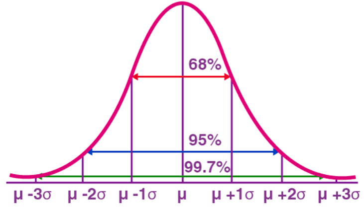
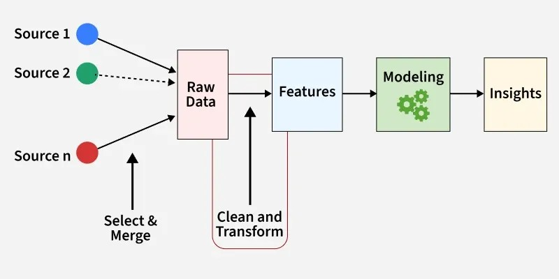
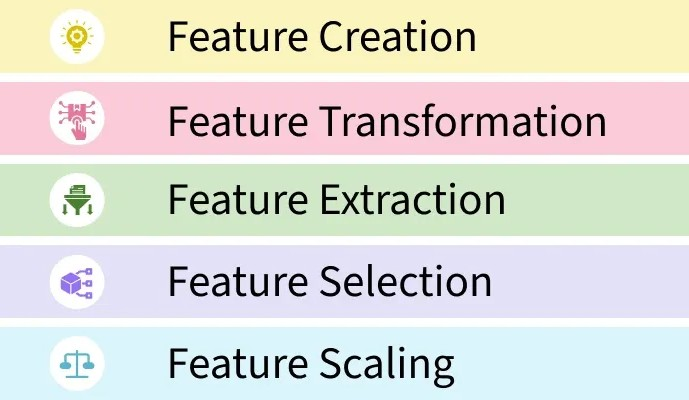

# Fraud and Anomaly Detection

::: {.callout-note}
## Learning Objectives
By the end of this chapter, you should be able to:

- Engineer features from transaction data suitable for statistical and machine learning anomaly detection
- Apply K-means clustering to identify groups of unusual transactions, and explain how feature choice shapes clustering results
- Apply Isolation Forest to flag anomalous transactions, and explain the intuition behind how it works
- Evaluate unsupervised detection methods using precision and recall against known anomalies
- Explain why rule-based tests (Chapter 8) and model-based anomaly detection each catch patterns the other misses, and why real fraud detection programs use both
:::

## From Red Flags to Statistical Anomaly Detection

Chapter 8 built rule-based tests: weekend postings, round-dollar amounts, cutoff timing, duplicates, rare posters. Each rule looks for one specific, pre-defined pattern. This chapter introduces a different approach: **unsupervised anomaly detection**^[We call it unsupervised because *ex ante* we do not know whether it is a fraud, meaning that it is not labeled from the beginning.], where a **statistical** or **machine learning** method looks for transactions that are unusual across *several dimensions at once*, without being told in advance exactly what pattern to look for.

We'll use two datasets already familiar from earlier chapters:

- `general_ledger_large.csv` (Chapter 5) — 752 transactions, including the **7 known outliers** we identified there using a z-score threshold, which we can now use as a benchmark to evaluate these new methods against
- `audit_test_transactions.csv` (Chapter 8) — 117 journal entries with deliberately embedded red-flag scenarios

## Z Score - A Statistical Method for Anomaly Detection

A Z-score is a statistical measurement that tells you how many standard deviations a specific data point is from the average (mean). To find a Z-score, you subtract the dataset's average from your data point, and then divide that number by the standard deviation: 

* Z-score of 0: The data point is exactly average. 

* Positive Z-score: The data point is above average. 

* Negative Z-score: The data point is below average 

$$Z = \frac{x - \mu}{\sigma}$$
Where, **$x$** = Your data point, **$\mu$** = The average of the dataset, and **$\sigma$** = The standard deviation.


Anomaly detection is the process of finding rare or unexpected events in data (like a sudden spike in website traffic or credit card fraud). Z-scores help find these events using a simple math rule. In normal data, about 99.7% of all data points fall between a Z-score of -3 and 3. This is often called the "3-sigma rule". Any data point that lands outside this -3 to 3 range (meaning its Z-score is greater than 3 or less than -3) is so rare that it is usually flagged as an anomaly or outlier. @fig-z-score-curve shows the distribution of normal data points using z scores. Z-score curve is also called normal distribution curve or bell shaped curve. 

{#fig-z-score-curve}


:::{.panel-tabset}
## pandas
```{python}
import pandas as pd
import numpy as np

gl = pd.read_csv("data/general_ledger_large.csv")
gl["entry_date"] = pd.to_datetime(gl["entry_date"])
debit = gl[gl["debit"] > 0].copy().reset_index(drop=True)

# Recall the 7 known outliers from Chapter 5 -- we'll treat these as a
# ground-truth benchmark for evaluating the new methods in this chapter
mean_debit, std_debit = debit["debit"].mean(), debit["debit"].std()
debit["z_score"] = (debit["debit"] - mean_debit) / std_debit
debit["known_outlier"] = debit["z_score"].abs() > 3

print("Known outliers:", debit["known_outlier"].sum())
```

## polars 

```{python}
import polars as pl

# Read the data
gl_pl = pl.read_csv(
    "data/general_ledger_large.csv",
    try_parse_dates=True
)

# Keep only debit transactions
debit_pl = (
    gl_pl
    .filter(pl.col("debit") > 0)
)

# Compute mean and standard deviation
mean_debit = debit_pl.select(
    pl.col("debit").mean()
).item()

std_debit = debit_pl.select(
    pl.col("debit").std()
).item()

# Compute z-score and identify known outliers
debit_pl = (
    debit_pl
    .with_columns(
        (
            (pl.col("debit") - mean_debit)
            / std_debit
        ).alias("z_score")
    )
    .with_columns(
        (
            pl.col("z_score").abs() > 3
        ).alias("known_outlier")
    )
)

print(
    "Known outliers:",
    debit_pl["known_outlier"].sum()
)
```

::: 


## Feature Engineering for Anomaly Detection

Feature Engineering is the process of selecting, creating or modifying features like input variables or data to help machine learning models learn patterns more effectively. It involves transforming raw data into meaningful inputs that improve model accuracy and performance. @fig-feature-engineering-architecture shows the architecture of feature engineering.  

{#fig-feature-engineering-architecture}

Feature engineering process involves handling missing values, encoding categories, scaling numbers, creating new features or combining existing ones. It helps turn messy real-world data into a form that models can understand and use for better predictions. @fig-feature-engineering-process shows activities that are typically performed in feature engineering.

{#fig-feature-engineering-process}

* **Feature Creation**: Feature creation involves generating new features from domain knowledge or by observing patterns in the data.  

* **Feature Transformation**: Feature transformation adjusts features to improve model learning, such as encoding categorical variables, logarithimic transformation of skewed data, or adjusting the range of feature for consistency.

* **Feature Extraction**: Feature extraction is transform existing features into a lower-dimensional or more informative representation. For example, Principal Component Analysis (PCA) is a feature extraction technique.

* **Feature Selection**: Feature selection involves choosing a subset of relevant features to use in the model. For feature selection, we can use filter methods - statistical measures like correlation; wrapper methods - select feature based on model performance; and embedded methods - feature selection embedded in the model.

* **Feature Scaling**: Feature scaling ensures all features contribute equally to the model. It involves min-max scaling or standard scaling. 

Both methods in this chapter need transactions represented as **numeric features**, not raw dates and text. A few useful features for transaction-level fraud detection:

:::{.panel-tabset}
## pandas
```{python}
debit["log_amount"] = np.log1p(debit["debit"])
debit["is_weekend"] = (debit["entry_date"].dt.weekday >= 5).astype(int)
debit["day_of_month"] = debit["entry_date"].dt.day

debit[["entry_id", "debit", "log_amount", "is_weekend", "day_of_month"]].head()
```

## polars 
```{python}
debit_pl = (
    debit_pl
    .with_columns(
        # Natural log of (1 + debit)
        pl.col("debit").log1p().alias("log_amount"),

        # Weekend indicator (Saturday=6, Sunday=7 in Polars)
        (pl.col("entry_date").dt.weekday() >= 6)
            .cast(pl.Int8)
            .alias("is_weekend"),

        # Day of the month
        pl.col("entry_date").dt.day().alias("day_of_month"),
    )
)

debit_pl.select(
    "entry_id",
    "debit",
    "log_amount",
    "is_weekend",
    "day_of_month",
).head()
```

:::

- **`log_amount`** compresses the wide range of transaction sizes (recall the heavy right skew from Chapter 5), which helps distance-based methods like clustering treat amount differences more sensibly.
- **`is_weekend`** encodes a categorical pattern (Chapter 8's weekend test) as a numeric feature.
- **`day_of_month`** can help surface period-end clustering patterns.

Which features you *choose* has a *major* effect on what these methods find — as the next section shows directly.

## K-Means Clustering for Anomaly Detection

**K-means clustering** groups similar observations together based on distance in feature space. For anomaly detection, the idea is simple: unusual transactions often end up isolated in their own small cluster, separate from the bulk of "normal" activity.

### Attempt 1: Clustering on Amount and Weekend Indicator

:::{.panel-tabset}
## pandas
```{python}
from sklearn.preprocessing import StandardScaler
from sklearn.cluster import KMeans

features_v1 = debit[["log_amount", "is_weekend"]]
X_scaled_v1 = StandardScaler().fit_transform(features_v1)

kmeans_v1 = KMeans(n_clusters=4, random_state=42, n_init=10)
debit["cluster_v1"] = kmeans_v1.fit_predict(X_scaled_v1)

debit["cluster_v1"].value_counts()
```

## polars 

```{python}
from sklearn.preprocessing import StandardScaler
from sklearn.cluster import KMeans
import polars as pl

# Select the features and convert to NumPy
features_v1 = debit_pl.select(
    "log_amount",
    "is_weekend"
).to_numpy()

# Standardize the features
X_scaled_v1 = StandardScaler().fit_transform(features_v1)

# Fit KMeans
kmeans_v1 = KMeans(
    n_clusters=4,
    random_state=42,
    n_init=10
)

clusters = kmeans_v1.fit_predict(X_scaled_v1)

# Add cluster labels back to the Polars DataFrame
debit_pl = debit_pl.with_columns(
    pl.Series("cluster_v1", clusters)
)

# Equivalent of value_counts()
cluster_counts = (
    debit_pl
    .group_by("cluster_v1")
    .len()
    .sort("cluster_v1")
)

print(cluster_counts)
```

:::


:::{.panel-tabset}
## pandas
```{python}
smallest_cluster_v1 = debit["cluster_v1"].value_counts().idxmin()
flagged_v1 = debit[debit["cluster_v1"] == smallest_cluster_v1]

print("Smallest cluster size:", len(flagged_v1))
print("Known outliers captured:", flagged_v1["known_outlier"].sum(), "/ 7")
```


## polars 

```{python}
# Find the smallest cluster
smallest_cluster_v1 = (
    debit_pl
    .group_by("cluster_v1")
    .len()
    .sort("len")
    .get_column("cluster_v1")[0]
)

# Filter observations belonging to the smallest cluster
flagged_v1 = (
    debit_pl
    .filter(pl.col("cluster_v1") == smallest_cluster_v1)
)

print("Smallest cluster size:", flagged_v1.height)
print("Known outliers captured:", flagged_v1["known_outlier"].sum(), "/ 7")
```

:::
This result is disappointing — the smallest cluster only captures 2 of the 7 known outliers.

::: {.callout-warning}
## Why Did This Fail?
Check how many transactions in the whole dataset occurred on a weekend:
```{python}
debit["is_weekend"].sum()
```

Exactly 23 — and our smallest cluster also had 23 members. **The clustering essentially just separated weekend from weekday transactions**, because `is_weekend` is a binary feature that creates a very clean, easy-to-separate split, while `log_amount` differences (even for our large outliers) look comparatively small after scaling. Only the outliers that *happened* to also land on a weekend got captured — a coincidence of our injected data design, not a genuine amount-based detection.

This is an important lesson: **clustering results are entirely shaped by which features you include and how they're scaled.** A single dominant categorical feature can hijack the clustering structure away from the pattern you actually care about.
:::

### Attempt 2: Clustering on Amount-Focused Features Only

:::{.panel-tabset}
## pandas
```{python}
features_v2 = debit[["log_amount", "z_score"]]
X_scaled_v2 = StandardScaler().fit_transform(features_v2)

kmeans_v2 = KMeans(n_clusters=4, random_state=42, n_init=10)
debit["cluster_v2"] = kmeans_v2.fit_predict(X_scaled_v2)

debit["cluster_v2"].value_counts()
```


## polars 

```{python}
from sklearn.preprocessing import StandardScaler
from sklearn.cluster import KMeans
import polars as pl

# Select the features and convert to NumPy
features_v2 = debit_pl.select(
    "log_amount",
    "z_score"
).to_numpy()

# Standardize the features
X_scaled_v2 = StandardScaler().fit_transform(features_v2)

# Fit KMeans
kmeans_v2 = KMeans(
    n_clusters=4,
    random_state=42,
    n_init=10
)

clusters = kmeans_v2.fit_predict(X_scaled_v2)

# Add cluster labels back to the Polars DataFrame
debit_pl = debit_pl.with_columns(
    pl.Series("cluster_v2", clusters)
)

# Equivalent of value_counts()
cluster_counts_v2 = (
    debit_pl
    .group_by("cluster_v2")
    .len()
    .sort("cluster_v2")
)

print(cluster_counts_v2)
```

:::

:::{.panel-tabset}
## pandas
```{python}
smallest_cluster_v2 = debit["cluster_v2"].value_counts().idxmin()
flagged_v2 = debit[debit["cluster_v2"] == smallest_cluster_v2]

print("Smallest cluster size:", len(flagged_v2))
flagged_v2[["entry_id", "debit", "known_outlier"]].sort_values("debit", ascending=False)
```

## polars 

```{python}
# Find the cluster with the fewest observations
smallest_cluster_v2 = (
    debit_pl
    .group_by("cluster_v2")
    .len()
    .sort("len")
    .get_column("cluster_v2")[0]
)

# Filter rows belonging to the smallest cluster
flagged_v2 = (
    debit_pl
    .filter(pl.col("cluster_v2") == smallest_cluster_v2)
)

print("Smallest cluster size:", flagged_v2.height)

(
    flagged_v2
    .select(
        "entry_id",
        "debit",
        "known_outlier",
    )
    .sort("debit", descending=True)
)
```


:::
By dropping the dominant `is_weekend` feature and clustering purely on magnitude-related features, the smallest cluster now contains **exactly the 7 known outliers — no more, no less.**

:::{.panel-tabset}
## seaborn
```{python}
import seaborn as sns
import matplotlib.pyplot as plt

plt.figure(figsize=(7, 4.5))
sns.scatterplot(
    data=debit, x="entry_date", y="debit",
    hue=debit["cluster_v2"].astype(str), palette="Set2", alpha=0.7
)
plt.title("K-Means Clusters (amount-focused features)")
plt.ylabel("Debit Amount ($)")
plt.tight_layout()
plt.show()
```

## plotnine

```{python}
from plotnine import (
    ggplot,
    aes,
    geom_point,
    labs,
    theme_minimal,
    theme,
    element_text
)

# Convert Polars to pandas
debit_pd = debit_pl.to_pandas()

# Convert cluster labels to strings for discrete coloring
debit_pd["cluster_v2"] = debit_pd["cluster_v2"].astype(str)

(
    ggplot(
        debit_pd,
        aes(
            x="entry_date",
            y="debit",
            color="cluster_v2"
        )
    )
    + geom_point(alpha=0.7)
    + labs(
        title="K-Means Clusters (amount-focused features)",
        x="Entry Date",
        y="Debit Amount ($)",
        color="Cluster"
    )
    + theme_minimal()
    + theme(
        figure_size=(7, 4.5),
        plot_title=element_text(ha="center")
    )
)
```


:::

::: {.callout-tip}
## Connect to Practice
This side-by-side comparison is worth remembering beyond this chapter: an unsupervised method isn't "wrong" when it produces an unexpected result — it's finding *some* real structure in the data, just not necessarily the structure you were hoping for. Before trusting a clustering result, always sanity-check what's actually driving the groupings, the way we did here by checking the weekend transaction count.
:::

## Isolation Forest

**Isolation Forest** takes a different approach: rather than grouping similar points together, it tries to *isolate* each observation with a series of random splits. The intuition is that anomalies — points that are few and different — take **fewer splits** to isolate than normal points buried in a dense cluster of similar observations. Points that get isolated quickly, across many random trees, receive a low (more anomalous) score.

:::{.panel-tabset}
## pandas
```{python}
from sklearn.ensemble import IsolationForest

iso_features = debit[["debit", "is_weekend", "day_of_month"]]

iso_model = IsolationForest(n_estimators=200, contamination=0.02, random_state=42)
debit["anomaly_pred"] = iso_model.fit_predict(iso_features)   # -1 = anomaly, 1 = normal
debit["anomaly_score"] = iso_model.decision_function(iso_features)  # lower = more anomalous

flagged_iso = debit[debit["anomaly_pred"] == -1].sort_values("anomaly_score")
print("Flagged:", len(flagged_iso))
flagged_iso[["entry_id", "debit", "anomaly_score", "known_outlier"]]
```

## polars 

```{python}
from sklearn.ensemble import IsolationForest
import polars as pl

# Select features and convert to NumPy
iso_features = (
    debit_pl
    .select(
        "debit",
        "is_weekend",
        "day_of_month"
    )
    .to_numpy()
)

# Fit Isolation Forest
iso_model = IsolationForest(
    n_estimators=200,
    contamination=0.02,
    random_state=42
)

anomaly_pred = iso_model.fit_predict(iso_features)          # -1 = anomaly, 1 = normal
anomaly_score = iso_model.decision_function(iso_features)   # Lower = more anomalous

# Add results back to the Polars DataFrame
debit_pl = debit_pl.with_columns(
    [
        pl.Series("anomaly_pred", anomaly_pred),
        pl.Series("anomaly_score", anomaly_score),
    ]
)

# Filter flagged anomalies
flagged_iso = (
    debit_pl
    .filter(pl.col("anomaly_pred") == -1)
    .sort("anomaly_score")
)

print("Flagged:", flagged_iso.height)

flagged_iso.select(
    "entry_id",
    "debit",
    "anomaly_score",
    "known_outlier"
)
```

:::
Unlike our first clustering attempt, Isolation Forest — even with `is_weekend` included as a feature — successfully captures all 7 known outliers, plus a few additional transactions. Isolation Forest tends to be more robust to this kind of feature-dominance issue than K-means, since it isolates based on how *easy* a point is to separate from the rest, across many random trees, rather than relying on a single distance calculation.

### The `contamination` Parameter Controls the Precision-Recall Tradeoff

`contamination` tells the model what fraction of the data to expect as anomalous. This directly trades off **precision** (of what you flag, how much is real) against **recall** (of what's real, how much you catch).


:::{.panel-tabset}
## pandas
```{python}
from sklearn.metrics import precision_score, recall_score

results = []
for contamination in [0.01, 0.02, 0.05]:
    model = IsolationForest(n_estimators=200, contamination=contamination, random_state=42)
    pred = model.fit_predict(iso_features)
    flagged = pred == -1
    results.append({
        "contamination": contamination,
        "num_flagged": flagged.sum(),
        "precision": round(precision_score(debit["known_outlier"], flagged), 3),
        "recall": round(recall_score(debit["known_outlier"], flagged), 3),
    })

pd.DataFrame(results)
```

## polars 

```{python}
from sklearn.ensemble import IsolationForest
from sklearn.metrics import precision_score, recall_score
import polars as pl

results = []

# Convert ground truth labels from Polars to NumPy
y_true = debit_pl["known_outlier"].to_numpy()

# iso_features is already a NumPy array from the previous step
for contamination in [0.01, 0.02, 0.05]:

    model = IsolationForest(
        n_estimators=200,
        contamination=contamination,
        random_state=42
    )

    pred = model.fit_predict(iso_features)

    # -1 = anomaly, convert to True/False
    flagged = pred == -1

    results.append(
        {
            "contamination": contamination,
            "num_flagged": flagged.sum(),
            "precision": round(
                precision_score(y_true, flagged),
                3
            ),
            "recall": round(
                recall_score(y_true, flagged),
                3
            ),
        }
    )

# Create Polars DataFrame
results_pl = pl.DataFrame(results)

results_pl
```


:::

::: {.callout-important}
## Reading This Table
At `contamination=0.01`, the model flags only 8 transactions, catching 6 of the 7 outliers (86% recall) with high precision (75%) — a tight, high-confidence list. At `contamination=0.05`, it flags 38 transactions and catches all 7 outliers (100% recall), but precision drops to just 18% — meaning roughly 4 out of every 5 flagged transactions turn out not to be one of our known outliers.

Neither setting is "correct" in the abstract. A team with limited review capacity might prefer the tighter, higher-precision list even if it risks missing one real anomaly; a team performing a high-stakes investigation might prefer to cast a wider net and accept more false positives in exchange for near-certain coverage. This tradeoff, not just the algorithm itself, is a central design decision in any real fraud detection program.
:::

## Combining Model-Based and Rule-Based Detection

Do Isolation Forest and the rule-based tests from Chapter 8 actually agree? Let's apply Isolation Forest to `audit_test_transactions.csv` — the dataset with known injected scenarios — and compare.

:::{.panel-tabset}
## pandas
```{python}
audit_gl = pd.read_csv("data/audit_test_transactions.csv")
audit_gl["entry_date"] = pd.to_datetime(audit_gl["entry_date"])
audit_gl["amount"] = audit_gl[["debit", "credit"]].max(axis=1)

entry_level = audit_gl.groupby("entry_id").agg(
    entry_date=("entry_date", "first"),
    amount=("amount", "max"),
    posted_by=("posted_by", "first"),
).reset_index()

entry_level["is_weekend"] = (entry_level["entry_date"].dt.weekday >= 5).astype(int)
entry_level["is_year_end"] = (entry_level["entry_date"] >= pd.Timestamp("2025-12-27")).astype(int)

poster_counts = audit_gl.groupby("posted_by")["entry_id"].nunique()
entry_level["poster_frequency"] = entry_level["posted_by"].map(poster_counts)

iso_features_audit = entry_level[["amount", "is_weekend", "is_year_end", "poster_frequency"]]

iso_audit = IsolationForest(n_estimators=200, contamination=0.1, random_state=42)
entry_level["anomaly_pred"] = iso_audit.fit_predict(iso_features_audit)

known_injected = ["JE5900", "JE5901", "JE5902", "JE5903", "JE5904", "JE5905", "JE5906"]
entry_level["is_known_injected"] = entry_level["entry_id"].isin(known_injected)

entry_level[entry_level["is_known_injected"]][["entry_id", "amount", "anomaly_pred", "is_known_injected"]]
```

## polars 

```{python}
import polars as pl
from sklearn.ensemble import IsolationForest

# Read data
audit_gl_pl = pl.read_csv(
    "data/audit_test_transactions.csv",
    try_parse_dates=True
)

# Create amount column (max of debit and credit)
audit_gl_pl = audit_gl_pl.with_columns(
    pl.max_horizontal(
        ["debit", "credit"]
    ).alias("amount")
)

# Roll transaction lines up to journal-entry level
entry_level_pl = (
    audit_gl_pl
    .group_by("entry_id")
    .agg(
        pl.col("entry_date").first().alias("entry_date"),
        pl.col("amount").max().alias("amount"),
        pl.col("posted_by").first().alias("posted_by"),
    )
)

# Add date-based features
entry_level_pl = entry_level_pl.with_columns(
    [
        (
            (pl.col("entry_date").dt.weekday() >= 6)
            .cast(pl.Int8)
            .alias("is_weekend")
        ),

        (
            (pl.col("entry_date") >= pl.date(2025, 12, 27))
            .cast(pl.Int8)
            .alias("is_year_end")
        ),
    ]
)

# Calculate poster frequency
poster_counts_pl = (
    audit_gl_pl
    .group_by("posted_by")
    .agg(
        pl.col("entry_id")
        .n_unique()
        .alias("poster_frequency")
    )
)

# Add poster frequency to entry-level data
entry_level_pl = (
    entry_level_pl
    .join(
        poster_counts_pl,
        on="posted_by",
        how="left"
    )
)

# Prepare Isolation Forest features
iso_features_audit = (
    entry_level_pl
    .select(
        "amount",
        "is_weekend",
        "is_year_end",
        "poster_frequency"
    )
    .to_numpy()
)

# Fit Isolation Forest
iso_audit = IsolationForest(
    n_estimators=200,
    contamination=0.1,
    random_state=42
)

anomaly_pred = iso_audit.fit_predict(
    iso_features_audit
)

# Add predictions
entry_level_pl = entry_level_pl.with_columns(
    pl.Series(
        "anomaly_pred",
        anomaly_pred
    )
)

# Known injected anomalies
known_injected = [
    "JE5900",
    "JE5901",
    "JE5902",
    "JE5903",
    "JE5904",
    "JE5905",
    "JE5906",
]

entry_level_pl = entry_level_pl.with_columns(
    pl.col("entry_id")
    .is_in(known_injected)
    .alias("is_known_injected")
)

# Show known injected entries
(
    entry_level_pl
    .filter(
        pl.col("is_known_injected")
    )
    .select(
        "entry_id",
        "amount",
        "anomaly_pred",
        "is_known_injected"
    )
)
```


:::

Isolation Forest catches 5 of our 7 deliberately injected scenarios — but **misses both duplicate entries (JE5903 and JE5904)** entirely.

::: {.callout-important}
## Why the Model Misses the Duplicates — and Why That's the Whole Point
Look at what features we gave the model: `amount`, `is_weekend`, `is_year_end`, `poster_frequency`. Nothing about the duplicate entries is unusual along *any* of those dimensions — they're a completely ordinary $3,000 rent payment, on a weekday, by a normal poster. The only thing wrong with them is that an **identical entry appears twice**, which isn't a pattern any of our numeric features can capture.

This is exactly why Chapter 8's rule-based duplicate test still matters even after adding machine learning to the toolkit: **a model can only find what its features make visible.** Isolation Forest is excellent at catching multivariate, magnitude-based anomalies without needing to specify the exact pattern in advance — but it cannot catch a pattern like "this exact combination of fields appeared before," because we never engineered a feature that would represent that relationship. A specific rule-based test, by contrast, was purpose-built to catch exactly that.

**The practical conclusion:** rule-based tests and model-based anomaly detection are **complements**, not *competitors*. A real fraud detection program runs both, precisely because each one has systematic blind spots the other doesn't share.
:::

## Evaluating Unsupervised Methods Without Labels

Everything in this chapter has had an advantage real fraud detection rarely has: we *know* which transactions were the true anomalies, because we built the data ourselves. In practice, you almost never have confirmed fraud labels to check your precision and recall against — that's the whole reason detection is hard.

A few practical approaches used when true labels aren't available:

- **Manual review of a sample of flagged items**, to informally estimate a precision rate before scaling a method up to a full population
- **Stability checks**: does the same method, run with a slightly different random seed or a slightly different feature set, flag roughly the same transactions? Wildly different results across runs suggest the model is picking up noise rather than a real signal
- **Cross-referencing with rule-based flags** (as we just did): if a transaction is flagged by *both* an unsupervised model and an independent rule-based test, that agreement itself is evidence worth weighing more heavily than either signal alone
- **Escalating gradually**: starting with a small, high-precision flagged set (like our `contamination=0.01` result), reviewing it, and only widening the net if that initial review turns up genuine issues

## Chapter Summary

- Anomaly detection methods require numeric features engineered from transaction data; the choice and scaling of features has a *major* effect on what these methods find, sometimes more than the choice of algorithm itself.
- K-means clustering can be hijacked by a single dominant categorical feature (like `is_weekend`), producing clusters that reflect that feature rather than the anomaly pattern you actually care about — always sanity-check what's driving a clustering result.
- Isolation Forest isolates anomalies based on how few random splits it takes to separate them from the rest of the data, and tends to be more robust than K-means to less-informative features being included.
- The `contamination` parameter controls a real precision-recall tradeoff: a stricter setting yields a smaller, higher-confidence list; a looser setting catches more true anomalies at the cost of many more false positives.
- Model-based and rule-based detection have different blind spots — in this chapter, Isolation Forest missed duplicate entries entirely, because "this is a duplicate" was never represented in the feature set. Real fraud detection programs use both approaches together for exactly this reason.
- Without confirmed fraud labels (the normal situation in practice), evaluating an unsupervised method relies on manual review, stability checks, and cross-referencing with independent rule-based signals rather than precision/recall against ground truth.

## Discussion Questions

1. In the first K-means attempt, the model effectively just separated weekend from weekday transactions. How would you have discovered this problem if you *hadn't* already known the true outlier count from Chapter 5?
2. If you were setting the `contamination` parameter for a real audit engagement with limited staff time, how would you decide between a stricter (higher precision) and looser (higher recall) setting?
3. Isolation Forest missed the duplicate-entry scenario entirely. Can you think of another type of fraud or error pattern that a purely numeric, feature-based model would likely miss, and what kind of rule-based test could catch it instead?

## Exercises

1. Add `department` (one-hot encoded) as an additional feature to the Isolation Forest model on `general_ledger_large.csv`. Does this change which transactions get flagged at `contamination=0.02`?
2. Rerun the K-means clustering from "Attempt 2" with `n_clusters` set to 3 and to 6 instead of 4. Does the smallest cluster still capture exactly the 7 known outliers in both cases?
3. Using `audit_test_transactions.csv`, engineer one additional feature that *would* help a model detect the duplicate-entry scenario (JE5903/JE5904), add it to the Isolation Forest feature set, and check whether the model now flags both entries.
4. Combine this chapter's Isolation Forest flags with Chapter 8's composite risk score (rule-based) for `audit_test_transactions.csv` into a single comparison table showing, for each of the 7 known injected entries, whether it was caught by (a) the rule-based score, (b) Isolation Forest, (c) both, or (d) neither.
