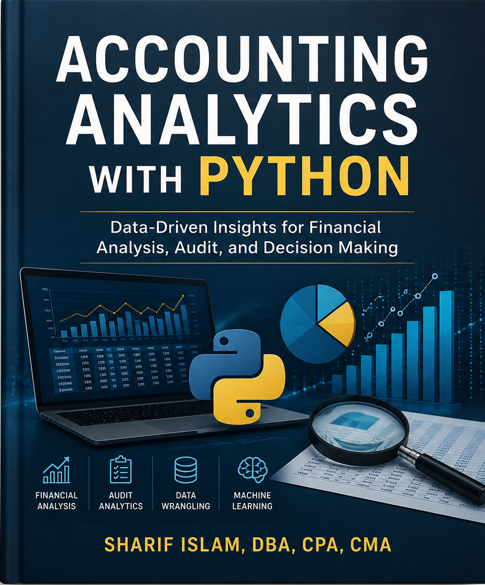

# Preface {.unnumbered}

Welcome to *Accounting Analytics with Python*. This book is intended for accounting undergraduate students. However, students from other disciplines such as Finance are very likely to be benefited from using the book. 

# About the Author {.unnumbered}

Sharif Islam, DBA, CPA, CMA is an Associate professor in School of Accountancy in Southern Illinois University Carbondale (SIUC). He is a licensed CPA in Illinois and a Certified Management Accountant (CMA). He teaches Advanced Cost Accounting, Auditing, Accounting Information Systems, Machine Learning, and Analytics for Accounting Data. He earned his doctorate from Louisiana Tech University. His mansucripts are selected for “Best Research Paper Award” in several conferences of American Accounting Association (AAA). His research also got 2024 “Notable Contribution to the Literature Award” by AIS section of AAA. He published research in *Accounting Horizons*, *Journal of Accounting and Public Policy*, *Journal of Information Systems*, *Advances in Accounting*, *Journal of Emerging Technologies in Accounting*, *Issues in Accounting Education*, and *Managerial Auditing Journal*. His research interests lie at the intersection of Accounting and Data Science. More about his teaching and research can be found in his [personal website](https://msharifbd.netlify.app/).

# Acknowledgement {.unnumbered}

To prepare the book, I took help from many sources on the internet and published materials. Many of them are cited in the book. I acknowledge the contribution of all of those resources that help me to prepare the book for the students.